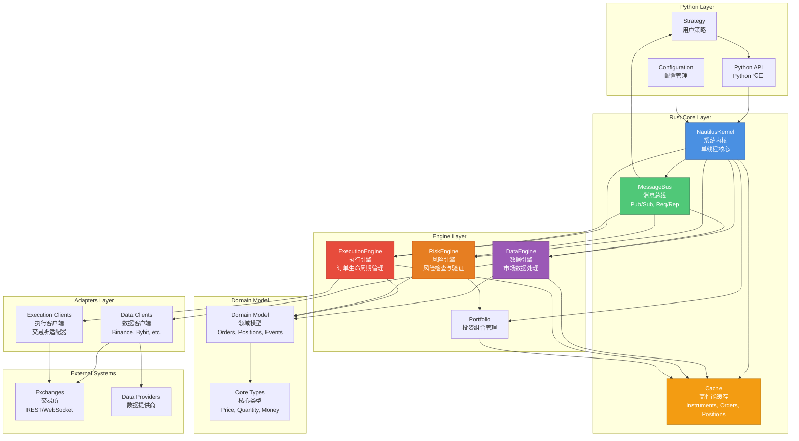
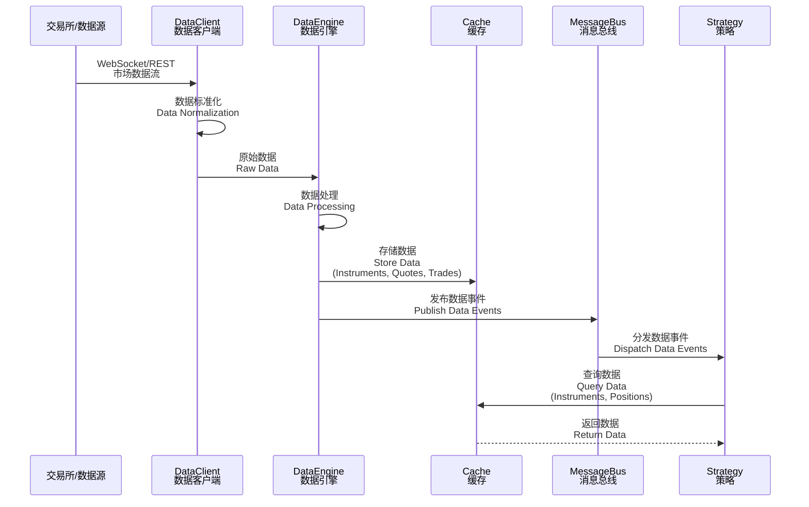
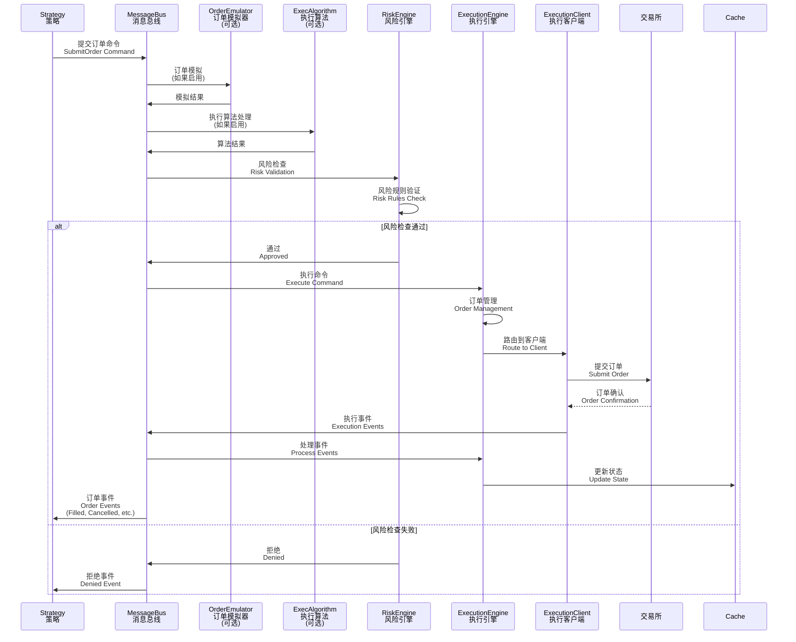
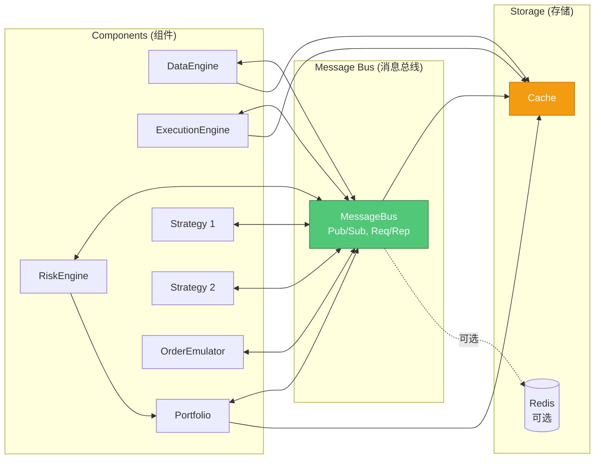
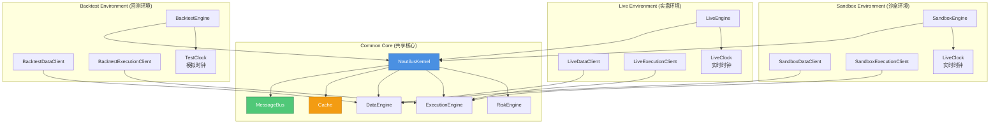

# 

[](https://codecov.io/gh/nautechsystems/nautilus_trader)
[](https://codspeed.io/nautechsystems/nautilus_trader)


[](https://pepy.tech/project/nautilus-trader)
[](https://discord.gg/NautilusTrader)

| Branch    | Version                                                                                                                                                                                                                     | Status                                                                                                                                                                                            |
| :-------- | :-------------------------------------------------------------------------------------------------------------------------------------------------------------------------------------------------------------------------- | :------------------------------------------------------------------------------------------------------------------------------------------------------------------------------------------------ |
| `master`  | [](https://packages.nautechsystems.io/simple/nautilus-trader/index.html)  | [](https://github.com/nautechsystems/nautilus_trader/actions/workflows/build.yml)  |
| `nightly` | [](https://packages.nautechsystems.io/simple/nautilus-trader/index.html) | [](https://github.com/nautechsystems/nautilus_trader/actions/workflows/build.yml) |
| `develop` | [](https://packages.nautechsystems.io/simple/nautilus-trader/index.html) | [](https://github.com/nautechsystems/nautilus_trader/actions/workflows/build.yml) |

| Platform           | Rust   | Python    |
| :----------------- | :----- | :-------- |
| `Linux (x86_64)`   | 1.91.1 | 3.12-3.14 |
| `Linux (ARM64)`    | 1.91.1 | 3.12-3.14 |
| `macOS (ARM64)`    | 1.91.1 | 3.12-3.14 |
| `Windows (x86_64)` | 1.91.1 | 3.12-3.14 |

-   **Docs**: <https://nautilustrader.io/docs/>
-   **Website**: <https://nautilustrader.io>
-   **Support**: [support@nautilustrader.io](mailto:support@nautilustrader.io)

## Introduction / 简介

NautilusTrader is an open-source, high-performance, production-grade algorithmic trading platform,
providing quantitative traders with the ability to backtest portfolios of automated trading strategies
on historical data with an event-driven engine, and also deploy those same strategies live, with no code changes.

NautilusTrader 是一个开源、高性能、生产级的算法交易平台，
为量化交易者提供使用事件驱动引擎在历史数据上回测自动化交易策略投资组合的能力，
并且可以在不更改代码的情况下实时部署这些相同的策略。

The platform is _AI-first_, designed to develop and deploy algorithmic trading strategies within a highly performant
and robust Python-native environment. This helps to address the parity challenge of keeping the Python research/backtest
environment consistent with the production live trading environment.

该平台以 _AI 优先_ 为设计理念，旨在在高度高性能和健壮的 Python 原生环境中开发和部署算法交易策略。
这有助于解决保持 Python 研究/回测环境与生产实盘交易环境一致性的挑战。

NautilusTrader's design, architecture, and implementation philosophy prioritizes software correctness and safety at the
highest level, with the aim of supporting Python-native, mission-critical, trading system backtesting
and live deployment workloads.

NautilusTrader 的设计、架构和实施理念将软件正确性和安全性放在最高优先级，
旨在支持 Python 原生的、关键任务的交易系统回测和实时部署工作负载。

The platform is also universal, and asset-class-agnostic — with any REST API or WebSocket feed able to be integrated via modular
adapters. It supports high-frequency trading across a wide range of asset classes and instrument types
including FX, Equities, Futures, Options, Crypto, DeFi, and Betting — enabling seamless operations across multiple venues simultaneously.

该平台还具有通用性，且与资产类别无关——任何 REST API 或 WebSocket 数据源都可以通过模块化适配器集成。
它支持跨多种资产类别和工具类型的高频交易，包括外汇、股票、期货、期权、加密货币、DeFi 和博彩——
能够在多个交易场所同时进行无缝操作。


## Architecture / 架构

NautilusTrader follows an event-driven architecture with a single-threaded core kernel that ensures deterministic behavior and maintains parity between backtesting and live trading environments.

NautilusTrader 采用事件驱动架构，具有单线程核心内核，确保确定性行为并保持回测和实盘交易环境之间的一致性。

### System Architecture Overview / 系统架构概览

The platform is organized in layers, with Python providing the user interface and Rust providing the high-performance core:

该平台采用分层组织，Python 提供用户界面，Rust 提供高性能核心：



### Data Flow / 数据流

Market data flows from external sources through the system to strategies:

市场数据从外部源通过系统流向策略：



### Execution Flow / 执行流

Trading commands flow from strategies through risk checks to execution:

交易命令从策略通过风险检查流向执行：



### Component Interaction / 组件交互

The following diagram shows how components interact through the message bus:

以下图表展示了组件如何通过消息总线进行交互：



### Environment Contexts / 环境上下文

NautilusTrader supports three environment contexts with shared core components:

NautilusTrader 支持三种环境上下文，共享核心组件：



## Features / 特性

-   **Fast**: Core is written in Rust with asynchronous networking using [tokio](https://crates.io/crates/tokio).
    **快速**：核心使用 Rust 编写，使用 [tokio](https://crates.io/crates/tokio) 进行异步网络通信。

-   **Reliable**: Rust-powered type- and thread-safety, with optional Redis-backed state persistence.
    **可靠**：Rust 驱动的类型安全和线程安全，支持可选的基于 Redis 的状态持久化。

-   **Portable**: OS independent, runs on Linux, macOS, and Windows. Deploy using Docker.
    **可移植**：操作系统无关，可在 Linux、macOS 和 Windows 上运行。使用 Docker 部署。

-   **Flexible**: Modular adapters mean any REST API or WebSocket feed can be integrated.
    **灵活**：模块化适配器意味着可以集成任何 REST API 或 WebSocket 数据源。

-   **Advanced**: Time in force `IOC`, `FOK`, `GTC`, `GTD`, `DAY`, `AT_THE_OPEN`, `AT_THE_CLOSE`, advanced order types and conditional triggers. Execution instructions `post-only`, `reduce-only`, and icebergs. Contingency orders including `OCO`, `OUO`, `OTO`.
    **高级**：有效时间 `IOC`、`FOK`、`GTC`、`GTD`、`DAY`、`AT_THE_OPEN`、`AT_THE_CLOSE`，高级订单类型和条件触发器。执行指令 `post-only`、`reduce-only` 和冰山订单。应急订单包括 `OCO`、`OUO`、`OTO`。

-   **Customizable**: Add user-defined custom components, or assemble entire systems from scratch leveraging the [cache](https://nautilustrader.io/docs/latest/concepts/cache) and [message bus](https://nautilustrader.io/docs/latest/concepts/message_bus).
    **可定制**：添加用户定义的自定义组件，或利用[缓存](https://nautilustrader.io/docs/latest/concepts/cache)和[消息总线](https://nautilustrader.io/docs/latest/concepts/message_bus)从头组装整个系统。

-   **Backtesting**: Run with multiple venues, instruments and strategies simultaneously using historical quote tick, trade tick, bar, order book and custom data with nanosecond resolution.
    **回测**：使用纳秒级精度的历史报价、交易、K 线、订单簿和自定义数据，同时运行多个交易场所、工具和策略。

-   **Live**: Use identical strategy implementations between backtesting and live deployments.
    **实盘**：在回测和实盘部署之间使用相同的策略实现。

-   **Multi-venue**: Multiple venue capabilities facilitate market-making and statistical arbitrage strategies.
    **多交易场所**：多交易场所功能支持做市和统计套利策略。

-   **AI Training**: Backtest engine fast enough to be used to train AI trading agents (RL/ES).
    **AI 训练**：回测引擎速度足够快，可用于训练 AI 交易代理（强化学习/进化策略）。


> _nautilus - from ancient Greek 'sailor' and naus 'ship'._ > _nautilus - 来自古希腊语 'sailor'（水手）和 naus 'ship'（船）。_
>
> _The nautilus shell consists of modular chambers with a growth factor which approximates a logarithmic spiral.
> The idea is that this can be translated to the aesthetics of design and architecture._ > _鹦鹉螺壳由模块化腔室组成，其增长因子近似于对数螺旋。
> 这个想法可以转化为设计和架构的美学。_

## Why NautilusTrader? / 为什么选择 NautilusTrader？

-   **Highly performant event-driven Python**: Native binary core components.
    **高性能事件驱动 Python**：原生二进制核心组件。

-   **Parity between backtesting and live trading**: Identical strategy code.
    **回测与实盘交易的一致性**：相同的策略代码。

-   **Reduced operational risk**: Enhanced risk management functionality, logical accuracy, and type safety.
    **降低运营风险**：增强的风险管理功能、逻辑准确性和类型安全。

-   **Highly extendable**: Message bus, custom components and actors, custom data, custom adapters.
    **高度可扩展**：消息总线、自定义组件和参与者、自定义数据、自定义适配器。

Traditionally, trading strategy research and backtesting might be conducted in Python
using vectorized methods, with the strategy then needing to be reimplemented in a more event-driven way
using C++, C#, Java or other statically typed language(s). The reasoning here is that vectorized backtesting code cannot
express the granular time and event dependent complexity of real-time trading, where compiled languages have
proven to be more suitable due to their inherently higher performance, and type safety.

传统上，交易策略研究和回测可能在 Python 中使用向量化方法进行，
然后需要使用 C++、C#、Java 或其他静态类型语言以更事件驱动的方式重新实现策略。
这里的理由是向量化回测代码无法表达实时交易的细粒度时间和事件依赖复杂性，
而编译语言由于其固有的更高性能和类型安全性已被证明更适合。

One of the key advantages of NautilusTrader here, is that this reimplementation step is now circumvented - as the critical core components of the platform
have all been written entirely in [Rust](https://www.rust-lang.org/) or [Cython](https://cython.org/).
This means we're using the right tools for the job, where systems programming languages compile performant binaries,
with CPython C extension modules then able to offer a Python-native environment, suitable for professional quantitative traders and trading firms.

NautilusTrader 的一个关键优势是，现在可以绕过这个重新实现步骤——因为平台的关键核心组件
已经完全用 [Rust](https://www.rust-lang.org/) 或 [Cython](https://cython.org/) 编写。
这意味着我们使用正确的工具来完成工作，系统编程语言编译高性能二进制文件，
然后 CPython C 扩展模块能够提供 Python 原生环境，适合专业量化交易者和交易公司。

## Why Python? / 为什么使用 Python？

Python was originally created decades ago as a simple scripting language with a clean straightforward syntax.
It has since evolved into a fully fledged general purpose object-oriented programming language.
Based on the TIOBE index, Python is currently the most popular programming language in the world.
Not only that, Python has become the _de facto lingua franca_ of data science, machine learning, and artificial intelligence.

Python 最初在几十年前被创建为一种具有简洁直接语法的简单脚本语言。
它已经发展成为一种成熟的全功能通用面向对象编程语言。
根据 TIOBE 指数，Python 目前是世界上最流行的编程语言。
不仅如此，Python 已经成为数据科学、机器学习和人工智能的 _事实上的通用语言_。

## Why Rust?

[Rust](https://www.rust-lang.org/) is a multi-paradigm programming language designed for performance and safety, especially safe
concurrency. Rust is "blazingly fast" and memory-efficient (comparable to C and C++) with no garbage collector.
It can power mission-critical systems, run on embedded devices, and easily integrates with other languages.

Rust’s rich type system and ownership model guarantees memory-safety and thread-safety deterministically —
eliminating many classes of bugs at compile-time.

The project increasingly utilizes Rust for core performance-critical components. Python bindings are implemented via Cython and [PyO3](https://pyo3.rs)—no Rust toolchain is required at install time.

This project makes the [Soundness Pledge](https://raphlinus.github.io/rust/2020/01/18/soundness-pledge.html):

> “The intent of this project is to be free of soundness bugs.
> The developers will do their best to avoid them, and welcome help in analyzing and fixing them.”

> [!NOTE]
>
> **MSRV:** NautilusTrader relies heavily on improvements in the Rust language and compiler.
> As a result, the Minimum Supported Rust Version (MSRV) is generally equal to the latest stable release of Rust.

## Integrations / 集成

NautilusTrader is modularly designed to work with _adapters_, enabling connectivity to trading venues
and data providers by translating their raw APIs into a unified interface and normalized domain model.

NautilusTrader 采用模块化设计，可与 _适配器_ 配合使用，通过将原始 API 转换为统一接口和标准化领域模型，
实现与交易场所和数据提供商的连接。

The following integrations are currently supported; see [docs/integrations/](https://nautilustrader.io/docs/latest/integrations/) for details:

| Name                                                                         | ID                    | Type                    | Status                                                  | Docs                                        |
| :--------------------------------------------------------------------------- | :-------------------- | :---------------------- | :------------------------------------------------------ | :------------------------------------------ |
| [Betfair](https://betfair.com)                                               | `BETFAIR`             | Sports Betting Exchange |     | [Guide](docs/integrations/betfair.md)       |
| [Binance](https://binance.com)                                               | `BINANCE`             | Crypto Exchange (CEX)   |     | [Guide](docs/integrations/binance.md)       |
| [BitMEX](https://www.bitmex.com)                                             | `BITMEX`              | Crypto Exchange (CEX)   |     | [Guide](docs/integrations/bitmex.md)        |
| [Bybit](https://www.bybit.com)                                               | `BYBIT`               | Crypto Exchange (CEX)   |     | [Guide](docs/integrations/bybit.md)         |
| [Coinbase International](https://www.coinbase.com/en/international-exchange) | `COINBASE_INTX`       | Crypto Exchange (CEX)   |     | [Guide](docs/integrations/coinbase_intx.md) |
| [Databento](https://databento.com)                                           | `DATABENTO`           | Data Provider           |     | [Guide](docs/integrations/databento.md)     |
| [Deribit](https://www.deribit.com)                                           | `DERIBIT`             | Crypto Exchange (CEX)   |  | [Guide](docs/integrations/deribit.md)       |
| [dYdX](https://dydx.exchange/)                                               | `DYDX`                | Crypto Exchange (DEX)   |     | [Guide](docs/integrations/dydx.md)          |
| [Hyperliquid](https://hyperliquid.xyz)                                       | `HYPERLIQUID`         | Crypto Exchange (DEX)   |  | [Guide](docs/integrations/hyperliquid.md)   |
| [Interactive Brokers](https://www.interactivebrokers.com)                    | `INTERACTIVE_BROKERS` | Brokerage (multi-venue) |     | [Guide](docs/integrations/ib.md)            |
| [Kraken](https://kraken.com)                                                 | `KRAKEN`              | Crypto Exchange (CEX)   |      | [Guide](docs/integrations/kraken.md)        |
| [OKX](https://okx.com)                                                       | `OKX`                 | Crypto Exchange (CEX)   |     | [Guide](docs/integrations/okx.md)           |
| [Polymarket](https://polymarket.com)                                         | `POLYMARKET`          | Prediction Market (DEX) |     | [Guide](docs/integrations/polymarket.md)    |
| [Tardis](https://tardis.dev)                                                 | `TARDIS`              | Crypto Data Provider    |     | [Guide](docs/integrations/tardis.md)        |

-   **ID**: The default client ID for the integrations adapter clients.
    **ID**：集成适配器客户端的默认客户端 ID。

-   **Type**: The type of integration (often the venue type).
    **Type**：集成的类型（通常是交易场所类型）。

### Status / 状态

-   `building`: Under construction and likely not in a usable state.
    `building`：正在构建中，可能无法使用。

-   `beta`: Completed to a minimally working state and in a beta testing phase.
    `beta`：已完成到最小可用状态，处于测试阶段。

-   `stable`: Stabilized feature set and API, the integration has been tested by both developers and users to a reasonable level (some bugs may still remain).
    `stable`：功能集和 API 已稳定，集成已由开发者和用户测试到合理水平（可能仍存在一些错误）。

See the [Integrations](https://nautilustrader.io/docs/latest/integrations/) documentation for further details.

## Versioning and releases / 版本和发布

> [!WARNING]
>
> **NautilusTrader is still under active development**. Some features may be incomplete, and while
> the API is becoming more stable, breaking changes can occur between releases.
> We strive to document these changes in the release notes on a **best-effort basis**.
> **NautilusTrader 仍在积极开发中**。某些功能可能不完整，虽然 API 正在变得更加稳定，
> 但版本之间仍可能发生破坏性更改。我们努力在发布说明中记录这些更改，但这是**尽力而为**的。

We aim to follow a **bi-weekly release schedule**, though experimental or larger features may cause delays.

我们的目标是遵循**双周发布计划**，尽管实验性或较大的功能可能会导致延迟。

### Branches / 分支

We aim to maintain a stable, passing build across all branches.

我们的目标是在所有分支上保持稳定、通过的构建。

-   `master`: Reflects the source code for the latest released version; recommended for production use.
    `master`：反映最新发布版本的源代码；推荐用于生产环境。

-   `nightly`: Daily snapshots of the `develop` branch for early testing; merged at **14:00 UTC** and as required.
    `nightly`：`develop` 分支的每日快照，用于早期测试；在**14:00 UTC** 并根据需要合并。

-   `develop`: Active development branch for contributors and feature work.
    `develop`：贡献者和功能工作的活跃开发分支。

> [!NOTE]
>
> Our [roadmap](/ROADMAP.md) aims to achieve a **stable API for version 2.x** (likely after the Rust port).
> Once this milestone is reached, we plan to implement a formal deprecation process for any API changes.
> This approach allows us to maintain a rapid development pace for now.

## Precision mode / 精度模式

NautilusTrader supports two precision modes for its core value types (`Price`, `Quantity`, `Money`),
which differ in their internal bit-width and maximum decimal precision.

NautilusTrader 为其核心值类型（`Price`、`Quantity`、`Money`）支持两种精度模式，
它们在内部位宽和最大小数精度方面有所不同。

-   **High-precision**: 128-bit integers with up to 16 decimals of precision, and a larger value range.
    **高精度**：128 位整数，最多 16 位小数精度，值范围更大。

-   **Standard-precision**: 64-bit integers with up to 9 decimals of precision, and a smaller value range.
    **标准精度**：64 位整数，最多 9 位小数精度，值范围较小。

> [!NOTE]
>
> By default, the official Python wheels ship in high-precision (128-bit) mode on Linux and macOS.
> On Windows, only standard-precision (64-bit) is available due to the lack of native 128-bit integer support.
> For the Rust crates, the default is standard-precision unless you explicitly enable the `high-precision` feature flag.

See the [Installation Guide](https://nautilustrader.io/docs/latest/getting_started/installation) for further details.

**Rust feature flag**: To enable high-precision mode in Rust, add the `high-precision` feature to your Cargo.toml:

```toml
[dependencies]
nautilus_model = { version = "*", features = ["high-precision"] }
```

## Installation / 安装

We recommend using the latest supported version of Python and installing [nautilus_trader](https://pypi.org/project/nautilus_trader/) inside a virtual environment to isolate dependencies.

我们建议使用最新支持的 Python 版本，并在虚拟环境中安装 [nautilus_trader](https://pypi.org/project/nautilus_trader/) 以隔离依赖项。

**There are two supported ways to install**:

**有两种支持的安装方式**：

1. Pre-built binary wheel from PyPI _or_ the Nautech Systems package index.
   从 PyPI _或_ Nautech Systems 包索引安装预构建的二进制 wheel。

2. Build from source.
   从源代码构建。

> [!TIP]
>
> We highly recommend installing using the [uv](https://docs.astral.sh/uv) package manager with a "vanilla" CPython.
>
> Conda and other Python distributions _may_ work but aren’t officially supported.

### From PyPI

To install the latest binary wheel (or sdist package) from PyPI using Python's pip package manager:

```bash
pip install -U nautilus_trader
```

Install optional dependencies as 'extras' for specific integrations (e.g., `betfair`, `docker`, `dydx`, `ib`, `polymarket`, `visualization`):

```bash
pip install -U "nautilus_trader[docker,ib]"
```

See the [Installation Guide](https://nautilustrader.io/docs/latest/getting_started/installation#extras) for the full list of available extras.

### From the Nautech Systems package index

The Nautech Systems package index (`packages.nautechsystems.io`) complies with [PEP-503](https://peps.python.org/pep-0503/) and hosts both stable and development binary wheels for `nautilus_trader`.
This enables users to install either the latest stable release or pre-release versions for testing.

#### Stable wheels

Stable wheels correspond to official releases of `nautilus_trader` on PyPI, and use standard versioning.

To install the latest stable release:

```bash
pip install -U nautilus_trader --index-url=https://packages.nautechsystems.io/simple
```

> [!TIP]
>
> Use `--extra-index-url` instead of `--index-url` if you want pip to fall back to PyPI automatically:

#### Development wheels

Development wheels are published from both the `nightly` and `develop` branches,
allowing users to test features and fixes ahead of stable releases.

This process also helps preserve compute resources and provides easy access to the exact binaries tested in CI pipelines,
while adhering to [PEP-440](https://peps.python.org/pep-0440/) versioning standards:

-   `develop` wheels use the version format `dev{date}+{build_number}` (e.g., `1.208.0.dev20241212+7001`).
-   `nightly` wheels use the version format `a{date}` (alpha) (e.g., `1.208.0a20241212`).

| Platform           | Nightly | Develop |
| :----------------- | :------ | :------ |
| `Linux (x86_64)`   | ✓       | ✓       |
| `Linux (ARM64)`    | ✓       | -       |
| `macOS (ARM64)`    | ✓       | ✓       |
| `Windows (x86_64)` | ✓       | ✓       |

**Note**: Development wheels from the `develop` branch publish for every supported platform except Linux ARM64.
Skipping that target keeps CI feedback fast while avoiding unnecessary build resource usage.

> [!WARNING]
>
> We do not recommend using development wheels in production environments, such as live trading controlling real capital.

#### Installation commands

By default, pip will install the latest stable release. Adding the `--pre` flag ensures that pre-release versions, including development wheels, are considered.

To install the latest available pre-release (including development wheels):

```bash
pip install -U nautilus_trader --pre --index-url=https://packages.nautechsystems.io/simple
```

To install a specific development wheel (e.g., `1.221.0a20251026` for October 26, 2025):

```bash
pip install nautilus_trader==1.221.0a20251026 --index-url=https://packages.nautechsystems.io/simple
```

#### Available versions

You can view all available versions of `nautilus_trader` on the [package index](https://packages.nautechsystems.io/simple/nautilus-trader/index.html).

To programmatically fetch and list available versions:

```bash
curl -s https://packages.nautechsystems.io/simple/nautilus-trader/index.html | grep -oP '(?<=<a href=")[^"]+(?=")' | awk -F'#' '{print $1}' | sort
```

> [!NOTE]
>
> On Linux, confirm your glibc version with `ldd --version` and ensure it reports **2.35** or newer before installing binary wheels.

#### Branch updates

-   `develop` branch wheels (`.dev`): Build and publish continuously with every merged commit.
-   `nightly` branch wheels (`a`): Build and publish daily when we automatically merge the `develop` branch at **14:00 UTC** (if there are changes).

#### Retention policies

-   `develop` branch wheels (`.dev`): We retain only the most recent wheel build.
-   `nightly` branch wheels (`a`): We retain only the 30 most recent wheel builds.

#### Verifying build provenance

All release artifacts (wheels and source distributions) published to PyPI, GitHub Releases,
and the Nautech Systems package index include cryptographic attestations that prove their authenticity and build provenance.

These attestations are generated automatically during the CI/CD pipeline using [SLSA](https://slsa.dev/) build provenance, and can be verified to ensure:

-   The artifact was built by the official NautilusTrader GitHub Actions workflow.
-   The artifact corresponds to a specific commit SHA in the repository.
-   The artifact hasn't been tampered with since it was built.

To verify a wheel file using the GitHub CLI:

```bash
gh attestation verify nautilus_trader-1.220.0-*.whl --owner nautechsystems
```

This provides supply chain security by allowing you to cryptographically verify that the installed package came from the official NautilusTrader build process.

> [!NOTE]
>
> Attestation verification requires the [GitHub CLI](https://cli.github.com/) (`gh`) to be installed.
> Development wheels from `develop` and `nightly` branches are also attested and can be verified the same way.

### From source

It's possible to install from source using pip if you first install the build dependencies as specified in the `pyproject.toml`.

1. Install [rustup](https://rustup.rs/) (the Rust toolchain installer):

    - Linux and macOS:

        ```bash
        curl https://sh.rustup.rs -sSf | sh
        ```

    - Windows:
        - Download and install [`rustup-init.exe`](https://win.rustup.rs/x86_64)
        - Install "Desktop development with C++" using [Build Tools for Visual Studio 2022](https://visualstudio.microsoft.com/visual-cpp-build-tools/)
    - Verify (any system):
      from a terminal session run: `rustc --version`

2. Enable `cargo` in the current shell:

    - Linux and macOS:

        ```bash
        source $HOME/.cargo/env
        ```

    - Windows:
        - Start a new PowerShell

3. Install [clang](https://clang.llvm.org/) (a C language frontend for LLVM):

    - Linux:

        ```bash
        sudo apt-get install clang
        ```

    - Windows:

        1. Add Clang to your [Build Tools for Visual Studio 2022](https://visualstudio.microsoft.com/visual-cpp-build-tools/):
            - Start | Visual Studio Installer | Modify | C++ Clang tools for Windows (latest) = checked | Modify
        2. Enable `clang` in the current shell:

            ```powershell
            [System.Environment]::SetEnvironmentVariable('path', "C:\Program Files\Microsoft Visual Studio\2022\BuildTools\VC\Tools\Llvm\x64\bin\;" + $env:Path,"User")
            ```

    - Verify (any system):
      from a terminal session run: `clang --version`

4. Install uv (see the [uv installation guide](https://docs.astral.sh/uv/getting-started/installation) for more details):

    - Linux and macOS:

        ```bash
        curl -LsSf https://astral.sh/uv/install.sh | sh
        ```

    - Windows (PowerShell):

        ```powershell
        irm https://astral.sh/uv/install.ps1 | iex
        ```

5. Clone the source with `git`, and install from the project's root directory:

    ```bash
    git clone --branch develop --depth 1 https://github.com/nautechsystems/nautilus_trader
    cd nautilus_trader
    uv sync --all-extras
    ```

> [!NOTE]
>
> The `--depth 1` flag fetches just the latest commit for a faster, lightweight clone.

6. Set environment variables for PyO3 compilation (Linux and macOS only):

    ```bash
    # Set the library path for the Python interpreter (in this case Python 3.13.4)
    export LD_LIBRARY_PATH="$HOME/.local/share/uv/python/cpython-3.13.4-linux-x86_64-gnu/lib:$LD_LIBRARY_PATH"

    # Set the Python executable path for PyO3
    export PYO3_PYTHON=$(pwd)/.venv/bin/python

    # Required for Rust tests when using uv-installed Python
    export PYTHONHOME=$(python -c "import sys; print(sys.base_prefix)")
    ```

> [!NOTE]
>
> Adjust the Python version and architecture in the `LD_LIBRARY_PATH` to match your system.
> Use `uv python list` to find the exact path for your Python installation.
>
> The `PYTHONHOME` variable is required when running `make cargo-test` with a `uv`-installed Python.
> Without it, tests that depend on PyO3 may fail to locate the Python runtime.

See the [Installation Guide](https://nautilustrader.io/docs/latest/getting_started/installation) for other options and further details.

## Redis

Using [Redis](https://redis.io) with NautilusTrader is **optional** and only required if configured as the backend for a
[cache](https://nautilustrader.io/docs/latest/concepts/cache) database or [message bus](https://nautilustrader.io/docs/latest/concepts/message_bus).
See the **Redis** section of the [Installation Guide](https://nautilustrader.io/docs/latest/getting_started/installation#redis) for further details.

在 NautilusTrader 中使用 [Redis](https://redis.io) 是**可选的**，仅在配置为
[缓存](https://nautilustrader.io/docs/latest/concepts/cache)数据库或[消息总线](https://nautilustrader.io/docs/latest/concepts/message_bus)的后端时才需要。
有关更多详细信息，请参阅[安装指南](https://nautilustrader.io/docs/latest/getting_started/installation#redis)的 **Redis** 部分。

## Makefile

A `Makefile` is provided to automate most installation and build tasks for development. Some of the targets include:

提供了 `Makefile` 来自动化大多数安装和构建任务以进行开发。一些目标包括：

-   `make install`: Installs in `release` build mode with all dependency groups and extras.
-   `make install-debug`: Same as `make install` but with `debug` build mode.
-   `make install-just-deps`: Installs just the `main`, `dev` and `test` dependencies (does not install package).
-   `make build`: Runs the build script in `release` build mode (default).
-   `make build-debug`: Runs the build script in `debug` build mode.
-   `make build-wheel`: Runs uv build with a wheel format in `release` mode.
-   `make build-wheel-debug`: Runs uv build with a wheel format in `debug` mode.
-   `make cargo-test`: Runs all Rust crate tests using `cargo-nextest`.
-   `make clean`: Deletes all build results, such as `.so` or `.dll` files.
-   `make distclean`: **CAUTION** Removes all artifacts not in the git index from the repository. This includes source files which have not been `git add`ed.
-   `make docs`: Builds the documentation HTML using Sphinx.
-   `make pre-commit`: Runs the pre-commit checks over all files.
-   `make ruff`: Runs ruff over all files using the `pyproject.toml` config (with autofix).
-   `make pytest`: Runs all tests with `pytest`.
-   `make test-performance`: Runs performance tests with [codspeed](https://codspeed.io).

> [!TIP]
>
> Run `make help` for documentation on all available make targets.

> [!TIP]
>
> See the [crates/infrastructure/TESTS.md](https://github.com/nautechsystems/nautilus_trader/blob/develop/crates/infrastructure/TESTS.md) file for running the infrastructure integration tests.

## Examples / 示例

Indicators and strategies can be developed in both Python and Cython. For performance and
latency-sensitive applications, we recommend using Cython. Below are some examples:

指标和策略可以在 Python 和 Cython 中开发。对于性能和延迟敏感的应用，我们建议使用 Cython。以下是一些示例：

-   [indicator](/nautilus_trader/examples/indicators/ema_python.py) example written in Python.
-   [indicator](/nautilus_trader/indicators/) implementations written in Cython.
-   [strategy](/nautilus_trader/examples/strategies/) examples written in Python.
-   [backtest](/examples/backtest/) examples using a `BacktestEngine` directly.

## Docker

Docker containers are built using the base image `python:3.12-slim` with the following variant tags:

Docker 容器使用基础镜像 `python:3.12-slim` 构建，具有以下变体标签：

-   `nautilus_trader:latest` has the latest release version installed.
-   `nautilus_trader:nightly` has the head of the `nightly` branch installed.
-   `jupyterlab:latest` has the latest release version installed along with `jupyterlab` and an
    example backtest notebook with accompanying data.
-   `jupyterlab:nightly` has the head of the `nightly` branch installed along with `jupyterlab` and an
    example backtest notebook with accompanying data.

You can pull the container images as follows:

```bash
docker pull ghcr.io/nautechsystems/<image_variant_tag> --platform linux/amd64
```

You can launch the backtest example container by running:

```bash
docker pull ghcr.io/nautechsystems/jupyterlab:nightly --platform linux/amd64
docker run -p 8888:8888 ghcr.io/nautechsystems/jupyterlab:nightly
```

Then open your browser at the following address:

```bash
http://127.0.0.1:8888/lab
```

> [!WARNING]
>
> NautilusTrader currently exceeds the rate limit for Jupyter notebook logging (stdout output).
> Therefore, we set the `log_level` to `ERROR` in the examples. Lowering this level to see more
> logging will cause the notebook to hang during cell execution. We are investigating a fix that
> may involve either raising the configured rate limits for Jupyter or throttling the log flushing
> from Nautilus.
>
> -   <https://github.com/jupyterlab/jupyterlab/issues/12845>
> -   <https://github.com/deshaw/jupyterlab-limit-output>

## Development / 开发

We aim to provide the most pleasant developer experience possible for this hybrid codebase of Python, Cython and Rust.
See the [Developer Guide](https://nautilustrader.io/docs/latest/developer_guide/) for helpful information.

我们的目标是为这个 Python、Cython 和 Rust 的混合代码库提供最愉快的开发体验。
有关有用信息，请参阅[开发者指南](https://nautilustrader.io/docs/latest/developer_guide/)。

> [!TIP]
>
> Run `make build-debug` to compile after changes to Rust or Cython code for the most efficient development workflow.

### Testing with Rust / 使用 Rust 进行测试

[cargo-nextest](https://nexte.st) is the standard Rust test runner for NautilusTrader.
Its key benefit is isolating each test in its own process, ensuring test reliability
by avoiding interference.

[cargo-nextest](https://nexte.st) 是 NautilusTrader 的标准 Rust 测试运行器。
它的主要优势是将每个测试隔离在自己的进程中，通过避免干扰来确保测试可靠性。

You can install cargo-nextest by running:

```bash
cargo install cargo-nextest
```

> [!TIP]
>
> Run Rust tests with `make cargo-test`, which uses **cargo-nextest** with an efficient profile.

## Contributing

Thank you for considering contributing to NautilusTrader! We welcome any and all help to improve
the project. If you have an idea for an enhancement or a bug fix, the first step is to open an [issue](https://github.com/nautechsystems/nautilus_trader/issues)
on GitHub to discuss it with the team. This helps to ensure that your contribution will be
well-aligned with the goals of the project and avoids duplication of effort.

Before getting started, be sure to review the [open-source scope](/ROADMAP.md#open-source-scope) outlined in the project’s roadmap to understand what’s in and out of scope.

Once you're ready to start working on your contribution, make sure to follow the guidelines
outlined in the [CONTRIBUTING.md](https://github.com/nautechsystems/nautilus_trader/blob/develop/CONTRIBUTING.md) file. This includes signing a Contributor License Agreement (CLA)
to ensure that your contributions can be included in the project.

> [!NOTE]
>
> Pull requests should target the `develop` branch (the default branch). This is where new features and improvements are integrated before release.

Thank you again for your interest in NautilusTrader! We look forward to reviewing your contributions and working with you to improve the project.

## Community / 社区

Join our community of users and contributors on [Discord](https://discord.gg/NautilusTrader) to chat
and stay up-to-date with the latest announcements and features of NautilusTrader. Whether you're a
developer looking to contribute or just want to learn more about the platform, all are welcome on our Discord server.

在我们的 [Discord](https://discord.gg/NautilusTrader) 上加入我们的用户和贡献者社区，进行交流
并了解 NautilusTrader 的最新公告和功能。无论您是希望做出贡献的开发者，还是只是想了解更多关于该平台的信息，
我们都欢迎您加入我们的 Discord 服务器。

> [!WARNING]
>
> NautilusTrader does not issue, promote, or endorse any cryptocurrency tokens. Any claims or communications suggesting otherwise are unauthorized and false.
>
> All official updates and communications from NautilusTrader will be shared exclusively through <https://nautilustrader.io>, our [Discord server](https://discord.gg/NautilusTrader),
> or our X (Twitter) account: [@NautilusTrader](https://x.com/NautilusTrader).
>
> If you encounter any suspicious activity, please report it to the appropriate platform and contact us at <info@nautechsystems.io>.

## License / 许可证

The source code for NautilusTrader is available on GitHub under the [GNU Lesser General Public License v3.0](https://www.gnu.org/licenses/lgpl-3.0.en.html).
Contributions to the project are welcome and require the completion of a standard [Contributor License Agreement (CLA)](https://github.com/nautechsystems/nautilus_trader/blob/develop/CLA.md).

NautilusTrader 的源代码在 GitHub 上根据 [GNU 较宽松通用公共许可证 v3.0](https://www.gnu.org/licenses/lgpl-3.0.en.html) 提供。
欢迎对项目做出贡献，需要完成标准的[贡献者许可协议（CLA）](https://github.com/nautechsystems/nautilus_trader/blob/develop/CLA.md)。

---

NautilusTrader™ is developed and maintained by Nautech Systems, a technology
company specializing in the development of high-performance trading systems.
For more information, visit <https://nautilustrader.io>.

NautilusTrader™ 由 Nautech Systems 开发和维护，这是一家专门开发高性能交易系统的技术公司。
有关更多信息，请访问 <https://nautilustrader.io>。

© 2015-2025 Nautech Systems Pty Ltd. All rights reserved.


