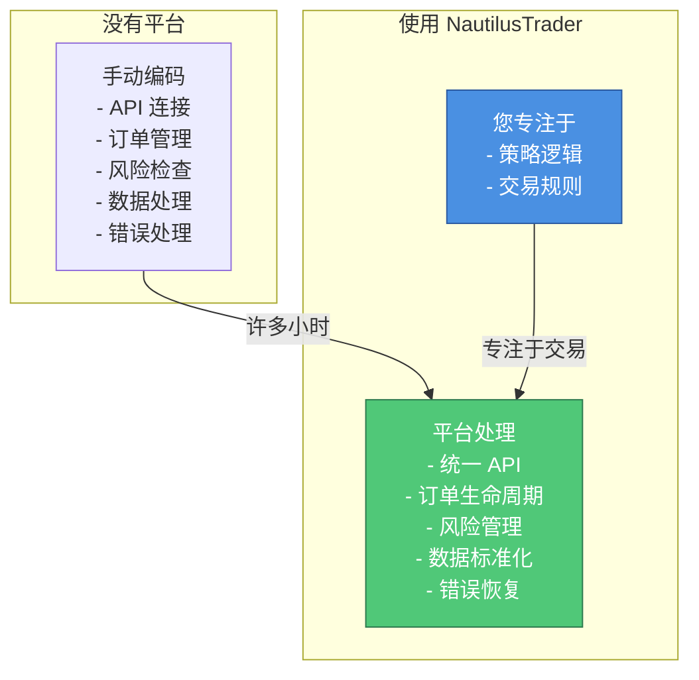

# 第 1 课：什么是算法交易？为什么选择 NautilusTrader？

**⏱ 课时**：1.5 小时  
**🎯 学习目标**：理解算法交易的概念和 NautilusTrader 的优势  
**📚 难度**：⭐ 基础入门

---

## 📖 课程概览

本课是 NautilusTrader 新手教程系列的第一课。我们将探讨什么是算法交易，它与手动交易的区别，以及为什么 NautilusTrader 是一个优秀的算法交易平台。通过本课，您将了解算法交易的基本概念、NautilusTrader 的核心优势，以及何时应该使用这个平台。

## 学习目标

在本课结束时，您将了解：

-   什么是算法交易，它与手动交易有何不同
-   为什么算法交易平台很有用
-   NautilusTrader 的主要优势
-   何时使用 NautilusTrader 来满足您的交易需求

## 什么是算法交易？

### 简单解释

想象您是一名交易员，坐在电脑前，看着市场价格上下波动。您有一个策略："当价格超过某个水平时，我会买入。当它低于另一个水平时，我会卖出。"

**手动交易**意味着您自己完成这些操作——盯着屏幕、做出决策、点击按钮下订单。

**算法交易**（也称为"自动交易"）意味着您编写一个计算机程序，自动为您完成这些操作。程序监控市场，根据您的规则做出决策，并在您不需要在场的情况下下订单。

### 现实世界的类比

将算法交易想象成交易的**智能家居助手**：

-   **手动交易**就像每次进入或离开房间时手动开关灯。

-   **算法交易**就像有运动传感器，当您进入时自动开灯，离开时自动关灯——您设置一次规则，系统自动处理。

### 为什么使用算法交易？

算法交易提供几个优势：

1. **速度**：计算机可以在毫秒内对市场变化做出反应，比人类快得多。

2. **一致性**：程序完全按照您的规则执行，不会受到情绪或疲劳的影响。

3. **24/7 运行**：您的交易策略可以持续运行，即使您在睡觉时也是如此。

4. **回测**：您可以在冒真金白银的风险之前，在历史数据上测试您的策略。

5. **多市场**：您可以同时交易多个市场，这很难手动完成。

## 为什么使用交易平台？

您可能会想："我不能只写一个连接到交易所 API 并下订单的 Python 脚本吗？"

您可以这样做，但构建一个健壮的交易系统涉及的内容远不止下订单：

### 交易平台提供什么

像 NautilusTrader 这样的交易平台提供：

1. **统一接口**：使用相同的代码连接到多个交易所。

2. **订单管理**：自动处理订单生命周期（已提交、已成交、已取消）。

3. **风险管理**：内置检查以防止危险的交易。

4. **数据标准化**：不同的交易所以不同的格式提供数据——平台处理这个问题。

5. **回测**：在历史数据上测试策略，使用与实盘相同的代码。

6. **错误处理**：健壮的错误处理和恢复机制。

## 为什么选择 NautilusTrader？

NautilusTrader 专为专业算法交易而设计。以下是它的特别之处：

### 主要优势

#### 1. **Python 原生**

您用 Python 编写策略，这是数据科学和机器学习最流行的语言。这意味着：

-   易于学习和使用
-   访问整个 Python 生态系统（pandas、numpy、scikit-learn 等）
-   非常适合研究和实验

#### 2. **高性能**

核心使用 Rust 编写，这是一种以速度和安全性著称的系统编程语言。这意味着：

-   快速执行（与 C/C++ 相当）
-   内存安全（不会因内存错误而崩溃）
-   类型安全（在编译时捕获错误）

#### 3. **回测-实盘一致性**

这是一个**改变游戏规则**的特性。使用 NautilusTrader：

-   编写一次策略
-   在历史数据上测试（回测）
-   使用**零代码更改**实盘部署

这消除了回测代码有效但实盘交易代码需要完全重写的常见问题。

#### 4. **事件驱动架构**

NautilusTrader 使用事件驱动架构，这意味着：

-   您的策略对市场事件做出反应（价格变化、订单成交等）
-   确定性行为（相同输入 = 相同输出）
-   非常适合回测（重放历史事件）

#### 5. **生产级**

NautilusTrader 为真实资金交易而构建：

-   全面的风险管理
-   多个交易所集成
-   健壮的错误处理
-   类型安全以防止错误

### 对比表

| 特性     | 手动交易 | 简单脚本   | NautilusTrader |
| :------- | :------- | :--------- | :------------- |
| 速度     | 慢       | 快         | 非常快         |
| 一致性   | 低       | 中         | 高             |
| 风险管理 | 手动     | 您自己构建 | 内置           |
| 多交易所 | 困难     | 困难       | 容易           |
| 回测     | 不可能   | 复杂       | 内置           |
| 代码复用 | N/A      | 低         | 高             |
| 学习曲线 | 容易     | 中         | 中             |

## 何时使用 NautilusTrader

NautilusTrader 非常适合：

### ✅ 适合的场景

-   **量化交易者**：开发和测试交易策略

-   **研究人员**：回测交易想法和假设

-   **专业交易者**：将策略部署到实盘市场

-   **交易公司**：构建生产交易系统

-   **学生**：学习算法交易

### ❌ 不适合的场景

-   **日内交易者**：更喜欢使用图表分析进行手动交易

-   **简单的一次性交易**：对于偶尔的交易，手动交易更简单

-   **没有编程经验**：需要基本的 Python 知识

## 实际例子

假设您想实现一个简单的策略："当 20 日移动平均线向上穿越 50 日移动平均线时买入。"

### 不使用 NautilusTrader

您需要：

1. 连接到交易所 API（每个交易所都不同）
2. 获取历史数据并计算移动平均线
3. 编写代码以检测交叉
4. 处理订单提交和管理
5. 监控持仓和处理错误
6. 为回测编写单独的代码
7. 为实盘交易重写所有内容

**估计时间：基本实现需要 2-4 周**

### 使用 NautilusTrader

您将：

1. 编写您的策略逻辑（检测交叉，下订单）
2. 在历史数据上测试（回测）
3. 部署实盘（相同代码，零更改）

**估计时间：完整实现需要 1-2 天**

## 💡 实践任务

### 任务 1：理解算法交易

-   [ ] 用自己的话解释什么是算法交易
-   [ ] 列出算法交易和手动交易的 3 个主要区别
-   [ ] 思考一个适合算法交易的场景

### 任务 2：探索 NautilusTrader

-   [ ] 访问 [NautilusTrader 官网](https://nautilustrader.io/)
-   [ ] 阅读项目 README
-   [ ] 查看 GitHub 仓库的示例代码
-   [ ] 了解项目的主要特性

### 任务 3：评估适用性

思考以下问题：

1.  您的交易需求是什么？
2.  NautilusTrader 是否适合您的需求？
3.  您需要学习哪些技能才能使用它？

## 📚 知识检查

### 基础问题

1. 算法交易和手动交易的主要区别是什么？
2. 为什么算法交易需要交易平台？
3. NautilusTrader 的三个核心优势是什么？
4. 什么是"回测-实盘一致性"？

### 进阶问题

1. 为什么 Python 是算法交易的好选择？
2. Rust 在 NautilusTrader 中扮演什么角色？
3. 什么情况下不应该使用 NautilusTrader？
4. 如何判断一个交易平台是否适合您的需求？

### 思考题

1. 算法交易是否适合所有类型的交易者？
2. 为什么回测-实盘一致性很重要？
3. 如何平衡易用性和性能？

## 🔗 参考资料

### NautilusTrader 资源

-   [NautilusTrader Documentation](https://nautilustrader.io/docs/) - 完整文档
-   [Installation Guide](../installation.md) - 安装指南
-   [Quickstart Guide](../quickstart.md) - 快速开始
-   [Architecture Overview](../../concepts/architecture.md) - 架构概览
-   [GitHub Repository](https://github.com/nautechsystems/nautilus_trader) - 源代码

### 算法交易学习

-   [Investopedia - Algorithmic Trading](https://www.investopedia.com/terms/a/algorithmictrading.asp)
-   [Quantitative Trading Basics](https://www.investopedia.com/articles/trading/11/quantitative-trading.asp)

## 📌 核心要点总结

1. **算法交易 = 用程序自动执行交易策略**
2. **交易平台处理基础设施，让您专注于策略逻辑**
3. **NautilusTrader 的优势：Python 原生、高性能、回测-实盘一致性**
4. **适合量化交易者、研究人员和专业交易者**
5. **需要基本的 Python 编程知识**

## ➡️ 下一课预告

**第 2 课：核心概念通俗解释**

在下一课中，我们将学习：

-   什么是策略、订单、持仓
-   回测的概念和重要性
-   数据流和执行流的工作原理
-   这些概念之间的关系

**准备工作**：

-   确保已理解算法交易的基本概念
-   准备好学习 NautilusTrader 的核心概念
-   准备纸笔或笔记工具记录要点

---

**🎯 学习检验标准**：

-   ✅ 能用自己的话解释算法交易
-   ✅ 理解 NautilusTrader 的核心优势
-   ✅ 知道何时应该使用 NautilusTrader
-   ✅ 了解算法交易的基本应用场景

完成这些内容后，你已经为学习 NautilusTrader 做好了准备！

## 总结

在本课中，我们学习了：

-   **算法交易**是使用计算机程序自动执行交易策略

-   像 NautilusTrader 这样的**交易平台**处理复杂的基础设施，让您专注于策略

-   **NautilusTrader** 提供 Python 原生开发、高性能和回测-实盘一致性

-   **用例**包括量化交易、研究和专业交易系统

## 下一步

既然您了解了什么是算法交易以及为什么 NautilusTrader 很有用，您就可以学习核心概念了！

👉 **下一课**：[第 2 课：核心概念通俗解释](第02课_核心概念通俗解释.md)
