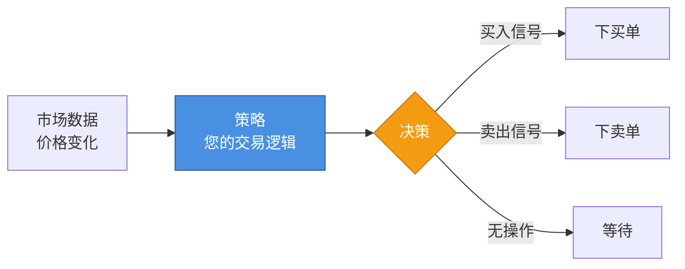
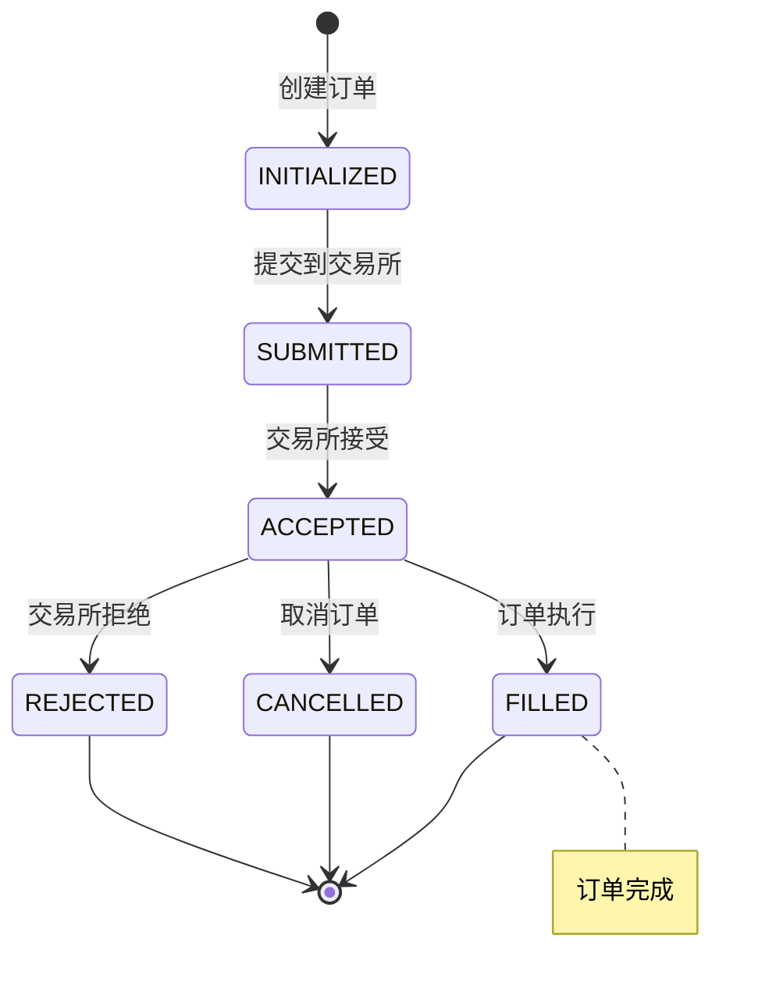
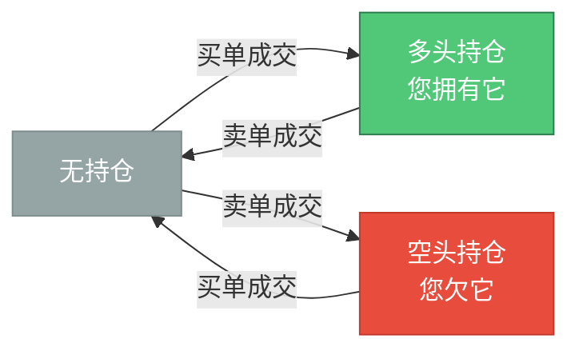
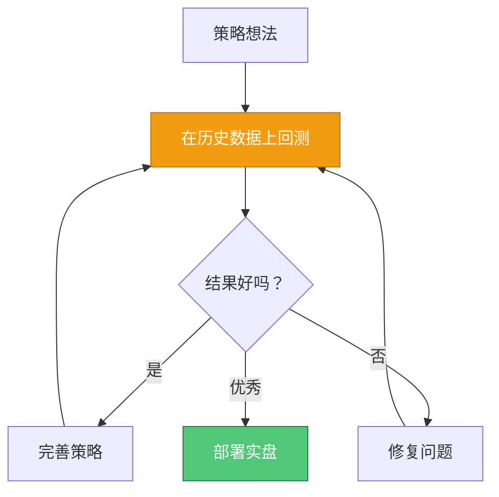
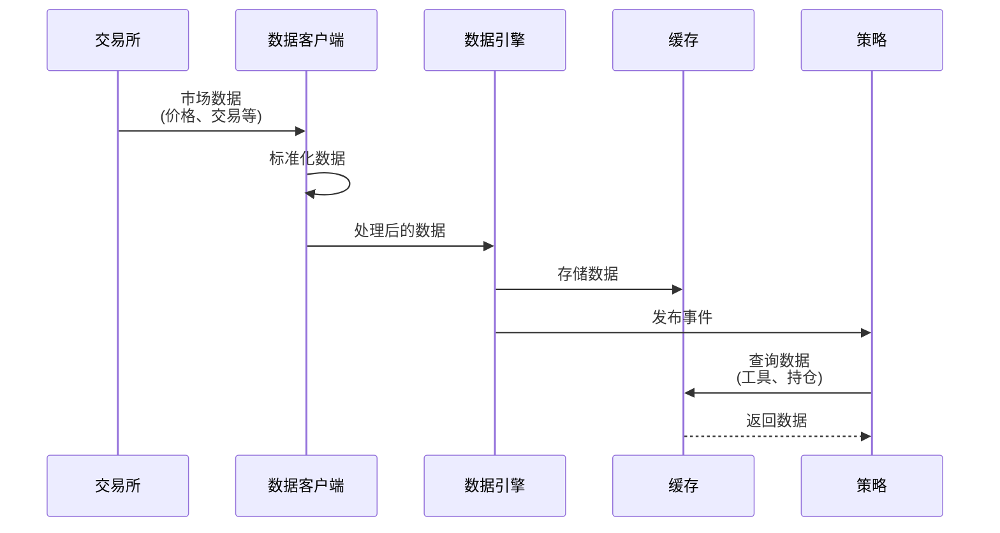
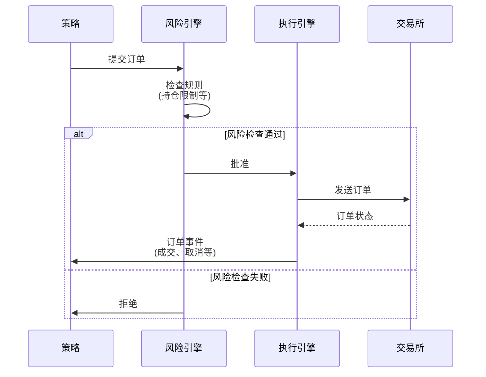
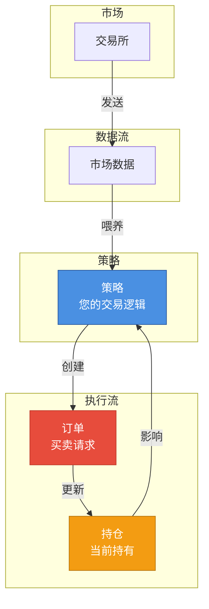

# 第 2 课：核心概念通俗解释

**⏱ 课时**：2 小时  
**🎯 学习目标**：理解策略、订单、持仓、回测等核心概念  
**📚 难度**：⭐ 基础入门

---

## 📖 课程概览

本课将深入讲解 NautilusTrader 量化交易系统的核心概念，包括交易策略的组成要素、订单的生命周期、持仓的管理方式、回测的重要性以及数据流和执行流的工作原理。这些知识是理解和开发交易策略的基础。

## 学习目标

在本课结束时，您将了解：

-   什么是策略以及它如何工作
-   什么是订单及其生命周期
-   什么是持仓以及如何管理它们
-   什么是回测以及为什么它很重要
-   数据如何在系统中流动
-   执行如何在系统中流动

## 策略

### 简单解释

**策略**就像**交易机器人的大脑**。它包含决定何时买入、何时卖出以及交易多少的规则和逻辑。

### 现实世界的类比

将策略想象成**交易食谱**：

-   **食谱**告诉您使用什么食材、何时添加以及如何烹饪。

-   **策略**告诉系统要关注什么市场条件、何时下订单以及如何管理风险。

### 策略如何工作



NautilusTrader 中的策略：

1.  **接收市场数据**（价格、交易、订单簿更新）

2.  **分析数据**使用您的交易规则

3.  **做出决策**（买入、卖出或等待）

4.  **下订单**当条件满足时

### 策略逻辑示例

```python
# 简化示例 - 不是实际代码

class MyStrategy:
    def on_price_update(self, price):
        # 如果价格超过 100，买入
        if price > 100:
            self.buy()

        # 如果价格低于 90，卖出
        elif price < 90:
            self.sell()
```

## 订单

### 简单解释

**订单**是**买入或卖出**特定数量工具的请求，以特定价格（或市价）执行。

### 现实世界的类比

将订单想象成**餐厅订单**：

-   您告诉服务员："我想要 2 个披萨，我愿意为每个支付最多 20 美元"

-   服务员将您的订单送到厨房

-   厨房准备您的订单

-   您收到您的披萨（订单成交）或订单被取消

### 订单生命周期



### 订单类型

您将使用的常见订单类型：

-   **市价单**："立即以最佳可用价格买入/卖出"

-   **限价单**："只有当价格达到或优于我指定的价格时才买入/卖出"

-   **止损单**："如果价格达到某个水平则买入/卖出（用于风险管理）"

## 持仓

### 简单解释

**持仓**代表您对某个工具的**当前持有量**。它显示您拥有（或欠）多少以及您的盈亏。

### 现实世界的类比

将持仓想象成您的**购物车**：

-   您将商品添加到购物车（买单）

-   您从购物车中移除商品（卖单）

-   您的购物车显示您当前拥有的（持仓）

-   总价值随价格变化而变化（盈亏）

### 持仓状态



### 持仓示例

假设您正在交易比特币：

1.  **您以 50,000 美元买入 1 个比特币**

    -   持仓：+1 比特币（多头）

2.  **价格上涨到 55,000 美元**

    -   持仓：+1 比特币
    -   未实现利润：+$5,000

3.  **您以 55,000 美元卖出 1 个比特币**
    -   持仓：0 比特币（已平仓）
    -   已实现利润：+$5,000

## 回测

### 简单解释

**回测**就像**重放视频游戏**——您在历史市场数据上测试您的策略，看看它在过去的表现如何。

### 现实世界的类比

将回测想象成**在模拟器中练习驾驶**：

-   您可以在不冒真金白银风险的情况下练习

-   您可以测试不同的场景（不同的市场条件）

-   您可以从错误中学习，而不会有真正的后果

-   一旦您有信心，您就可以真正驾驶（实盘交易）

### 为什么回测很重要



回测帮助您：

1.  **测试您的策略**在冒真金白银风险之前

2.  **发现问题**在您的逻辑中

3.  **优化参数**（例如，"如果我使用 20 日移动平均线而不是 10 日会怎样？"）

4.  **建立信心**在实盘交易之前

## 数据流

### 简单解释

**数据流**描述了市场信息如何从交易所通过系统流向您的策略。

### 现实世界的类比

将数据流想象成**新闻传递系统**：

1.  **新闻发生**（市场事件在交易所发生）

2.  **新闻被收集**（数据客户端接收市场数据）

3.  **新闻被处理**（数据引擎标准化并存储数据）

4.  **新闻被传递**（策略接收相关数据）

### 数据流图



### 什么数据在流动？

常见的市场数据类型：

-   **价格更新**：当前买卖价格

-   **交易**：已完成的交易

-   **订单簿**：市场中当前的买卖订单

-   **K 线**：聚合的价格数据（OHLC - 开盘、最高、最低、收盘）

## 执行流

### 简单解释

**执行流**描述了您的交易命令如何从您的策略通过风险检查流向交易所。

### 现实世界的类比

将执行流想象成**通过餐厅点餐**：

1.  **您决定点什么**（策略创建订单）

2.  **服务员检查是否有货**（风险引擎验证）

3.  **厨房准备您的订单**（执行引擎处理）

4.  **订单被送到厨房**（订单被发送到交易所）

5.  **您收到确认**（订单成交或被拒绝）

### 执行流图



### 为什么需要风险检查？

风险检查防止危险的交易：

-   **持仓限制**："不要让我损失超过 10,000 美元"

-   **订单大小限制**："不要让我下超过 100 单位的订单"

-   **价格限制**："不要让我以过高的价格买入"

## 概念关系

以下是这些概念如何协同工作：



### 完整图景

1.  **市场数据流入** → 策略接收价格更新

2.  **策略分析** → 做出交易决策

3.  **策略创建订单** → 请求买入/卖出

4.  **订单被执行** → 持仓被更新

5.  **持仓影响未来决策** → 策略考虑当前持有

## 💡 实践任务

### 任务 1：概念理解检查

-   [ ] 用自己的话解释什么是策略
-   [ ] 画出订单的生命周期图
-   [ ] 解释多头和空头的区别
-   [ ] 说明为什么回测很重要

### 任务 2：绘制流程图

使用纸笔或流程图工具，画出以下流程：

1.  **数据流**：从交易所到策略的完整路径
2.  **执行流**：从策略创建订单到交易所确认的完整路径
3.  **策略决策流程**：策略如何根据市场数据做出交易决策

### 任务 3：概念关系图

创建一个图表，展示以下概念之间的关系：

-   Strategy（策略）
-   Order（订单）
-   Position（持仓）
-   Backtest（回测）
-   Data Flow（数据流）
-   Execution Flow（执行流）

## 📚 知识检查

### 基础问题

1. 策略的三要素是什么？
2. 订单从创建到成交要经历哪些状态？
3. 多头持仓和空头持仓有什么区别？
4. 为什么在实盘交易前要进行回测？

### 进阶问题

1. 数据流和执行流的区别是什么？
2. 为什么需要风险检查？风险检查在哪个环节进行？
3. 持仓如何影响策略的后续决策？
4. 回测和实盘交易的主要区别是什么？

### 思考题

1. 如果一个策略只接收数据但从不创建订单，会发生什么？
2. 为什么订单可能被拒绝？被拒绝的订单会怎样？
3. 如何确保回测结果能真实反映策略在实盘中的表现？

## 🔗 参考资料

### NautilusTrader 文档

-   [Strategies Guide](../../concepts/strategies.md) - 策略开发完整指南
-   [Orders Guide](../../concepts/orders.md) - 订单管理详细说明
-   [Positions Guide](../../concepts/positions.md) - 持仓管理详解
-   [Backtesting Guide](../../concepts/backtesting.md) - 回测最佳实践
-   [Data Guide](../../concepts/data.md) - 数据类型和处理
-   [Execution Guide](../../concepts/execution.md) - 执行流程详解

### 交易基础知识

-   [Investopedia - Trading Basics](https://www.investopedia.com/trading-4427695)
-   [Algorithmic Trading Concepts](https://www.investopedia.com/terms/a/algorithmictrading.asp)

## 📌 核心要点总结

1. **策略 = 交易规则 + 决策逻辑 + 风险管理**
2. **订单有完整的生命周期，从创建到成交或取消**
3. **持仓反映当前的市场暴露，影响后续决策**
4. **回测是验证策略的关键步骤，必须在实盘前进行**
5. **数据流和执行流是系统运行的两条主线**
6. **理解概念之间的关系比记住单个概念更重要**

## ➡️ 下一课预告

**第 3 课：编写第一个策略**

在下一课中，我们将学习：

-   如何设置 NautilusTrader 环境
-   如何编写一个简单的交易策略
-   如何创建和运行回测
-   如何理解回测结果

**准备工作**：

-   确保 Python 3.12-3.14 已安装
-   确保 NautilusTrader 已安装
-   准备一个代码编辑器（VS Code、PyCharm 等）

---

**🎯 学习检验标准**：

-   ✅ 能用自己的话解释策略、订单、持仓、回测的概念
-   ✅ 能画出数据流和执行流的流程图
-   ✅ 理解订单的生命周期和状态转换
-   ✅ 理解回测的重要性和基本流程
-   ✅ 能解释概念之间的关系

完成这些内容后，你已经掌握了 NautilusTrader 的核心概念基础！

## 总结

在本课中，我们学习了：

-   **策略**是您交易机器人的大脑——它包含您的交易规则

-   **订单**是买入或卖出的请求——它经历一个生命周期

-   **持仓**是您当前的持有量——它显示您拥有什么以及您的盈亏

-   **回测**让您在冒真金白银风险之前在历史数据上测试策略

-   **数据流**将市场信息带到您的策略

-   **执行流**将您的交易命令通过风险检查发送到交易所

## 下一步

既然您了解了核心概念，您就可以编写第一个策略了！

👉 **下一课**：[第 3 课：编写第一个策略](第03课_编写第一个策略.md)
