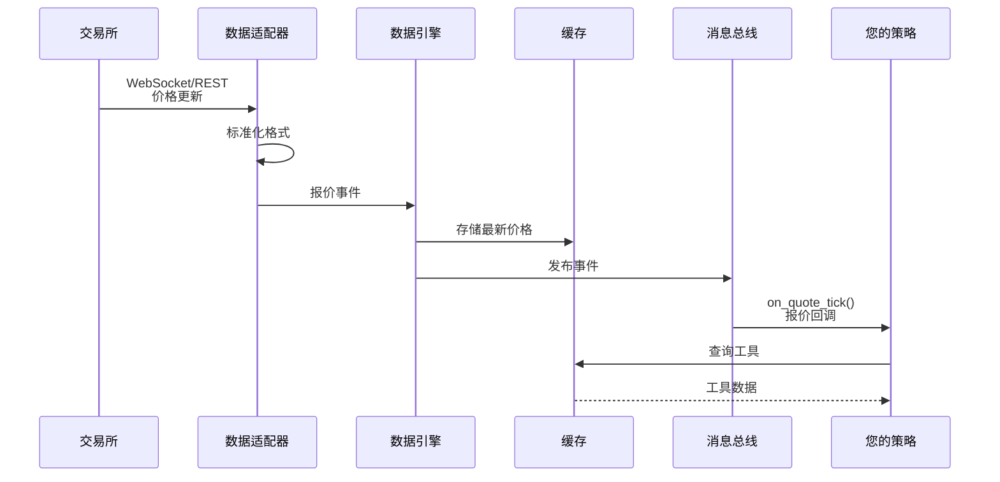
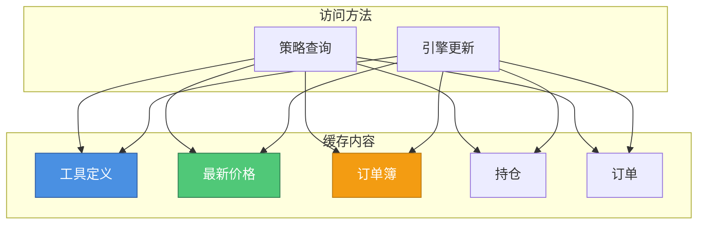

# 第 4 课：理解数据流

**⏱ 课时**：2 小时  
**🎯 学习目标**：理解数据如何在系统中流动，掌握数据订阅和访问方法  
**📚 难度**：⭐⭐ 中级

---

## 📖 课程概览

本课将深入讲解 NautilusTrader 中的数据流机制。我们将追踪数据从交易所到策略的完整路径，学习如何订阅不同类型的数据，如何访问缓存数据，以及实时数据和历史数据的区别。理解数据流是编写高效交易策略的基础。

## 学习目标

在本课结束时，您将了解：

-   市场数据如何进入系统
-   数据如何被处理和标准化
-   如何订阅不同的数据类型
-   如何在策略中访问缓存数据
-   实时数据和历史数据的区别

## 数据之旅

让我们追踪单个价格更新如何在系统中流动：



## 第 1 步：数据入口

### 数据来源

市场数据可以来自：

1.  **实盘交易所**：实时 WebSocket 流

2.  **数据提供商**：如 Databento、Tardis 等服务

3.  **历史文件**：用于回测的 CSV、Parquet 文件

4.  **模拟数据**：用于测试的生成数据

### 数据适配器

每个交易所有不同的数据格式。适配器处理这个问题：

```python
# 简化示例

# 交易所发送：{"price": "50000.5", "size": "0.1"}

# 适配器标准化为：QuoteTick(price=50000.5, size=0.1)
```

**为什么这很重要**：无论您使用哪个交易所，您的策略代码都相同！

## 第 2 步：数据处理

### 数据引擎

数据引擎就像市场数据的**邮局**：

-   从多个来源接收数据
-   标准化并验证它
-   将其路由到正确的位置
-   将其存储在缓存中

### 数据标准化

不同的交易所以不同的格式提供数据：

| 交易所         | 价格格式          | 时间格式          |
| :------------- | :---------------- | :---------------- |
| Binance        | String: "50000.5" | Unix milliseconds |
| Bybit          | Number: 50000.5   | Unix nanoseconds  |
| NautilusTrader | Price(50000.5)    | Unix nanoseconds  |

数据引擎将所有内容转换为 NautilusTrader 的标准格式。

## 第 3 步：数据存储

### 缓存

缓存就像内存中的**快速访问数据库**：



### 什么被缓存？

-   **工具**：您要交易的内容的定义

-   **最新价格**：最新的买卖价格

-   **订单簿**：当前市场深度

-   **持仓**：您当前的持有量

-   **订单**：活跃和历史订单

## 第 4 步：数据传递

### 消息总线

消息总线就像**广播系统**：

-   组件发布事件（就像广播电台）

-   策略订阅事件（就像调到广播电台）

-   事件被传递给所有订阅者

### 订阅模型

您的策略订阅它需要的数据：

```python
def on_start(self):
    # 订阅 K 线数据
    self.subscribe_bars(self.bar_type)

    # 订阅报价（买卖价格）
    self.subscribe_quotes(self.instrument_id)

    # 订阅交易
    self.subscribe_trades(self.instrument_id)
```

## 您可以订阅的数据类型

### 1. 报价

**它是什么**：当前买卖价格

**何时使用**：用于做市、价差分析

```python
def on_quote_tick(self, quote: QuoteTick):
    bid = quote.bid  # 最佳买入价格
    ask = quote.ask  # 最佳卖出价格
    spread = ask - bid  # 价差
```

### 2. 交易

**它是什么**：已完成的交易

**何时使用**：用于成交量分析、价格行为

```python
def on_trade_tick(self, trade: TradeTick):
    price = trade.price  # 交易价格
    size = trade.size    # 交易大小
```

### 3. K 线

**它是什么**：聚合的价格数据（OHLC）

**何时使用**：用于技术分析、指标

```python
def on_bar(self, bar: Bar):
    open_price = bar.open
    high_price = bar.high
    low_price = bar.low
    close_price = bar.close
    volume = bar.volume
```

### 4. 订单簿

**它是什么**：市场中当前的买卖订单

**何时使用**：用于市场深度分析、订单流

```python
def on_order_book_delta(self, delta: OrderBookDelta):
    # 订单簿已更改
    pass
```

## 访问缓存数据

您的策略可以查询缓存以获取信息：

### 获取工具信息

```python
# 获取工具详情
instrument = self.cache.instrument(self.instrument_id)
print(f"Trading: {instrument.id}")
print(f"Tick size: {instrument.price_increment}")
```

### 获取最新价格

```python
# 获取最新报价
quote = self.cache.quote(self.instrument_id)
if quote:
    bid = quote.bid
    ask = quote.ask
```

### 获取当前持仓

```python
# 获取您的持仓
position = self.cache.position(self.instrument_id)
if position:
    quantity = position.quantity
    pnl = position.unrealized_pnl()
```

## 实时数据 vs 历史数据

### 实时数据（实盘交易）


-   数据实时到达
-   您的策略立即反应
-   用于实盘交易

### 历史数据（回测）


-   所有数据预先加载
-   事件按顺序重放
-   用于回测

**关键点**：您的策略代码对两者都相同！

## 实际示例

让我们看一个使用多种数据类型的策略：

```python
class MultiDataStrategy(Strategy):
    def __init__(self):
        super().__init__()
        self.instrument_id = InstrumentId.from_str("BTC/USDT.BINANCE")

    def on_start(self):
        # 订阅多种数据类型
        self.subscribe_quotes(self.instrument_id)  # 价格更新
        self.subscribe_trades(self.instrument_id)  # 已完成的交易
        self.subscribe_bars(BarType.from_str("BTC/USDT.BINANCE-1-MINUTE-LAST"))

    def on_quote_tick(self, quote: QuoteTick):
        # 对价格变化做出反应
        spread = quote.ask - quote.bid
        if spread < 1.0:  # 价差很小
            self.log.info(f"Tight spread: {spread}")

    def on_trade_tick(self, trade: TradeTick):
        # 对交易做出反应
        if trade.size > 100:  # 大额交易
            self.log.info(f"Large trade: {trade.size} at {trade.price}")

    def on_bar(self, bar: Bar):
        # 对 K 线完成做出反应
        # 访问缓存数据
        quote = self.cache.quote(self.instrument_id)
        if quote:
            current_price = quote.mid_price()
            if bar.close > current_price:
                self.log.info("Bar closed above current price")
```

## 常见模式

### 模式 1：在交易前等待数据

```python
def on_start(self):
    self.subscribe_bars(self.bar_type)
    self.has_data = False

def on_bar(self, bar: Bar):
    if not self.has_data:
        self.has_data = True
        self.log.info("First bar received, ready to trade!")

    # 现在可以安全交易
    if self.has_data:
        # 您的交易逻辑
        pass
```

### 模式 2：使用缓存数据做决策

```python
def on_bar(self, bar: Bar):
    # 从缓存获取当前持仓
    position = self.cache.position(self.instrument_id)

    if position and position.is_net_long():
        # 已经做多，可能获利了结
        if bar.close > entry_price * 1.02:  # 2% 利润
            self.close_position(self.instrument_id)
```

### 模式 3：组合多个数据源

```python
def on_quote_tick(self, quote: QuoteTick):
    # 存储最新报价
    self.last_quote = quote

def on_bar(self, bar: Bar):
    # 使用 K 线和报价数据
    if self.last_quote:
        if bar.close > self.last_quote.ask:
            # 价格移动到卖价上方
            self.log.info("Price breakout detected")
```

## 💡 实践任务

### 任务 1：理解数据流路径

-   [ ] 画出数据从交易所到策略的完整流程图
-   [ ] 解释每个组件（适配器、数据引擎、缓存、消息总线）的作用
-   [ ] 理解为什么需要数据标准化

### 任务 2：订阅不同类型的数据

创建一个策略，订阅以下所有数据类型：

-   [ ] QuoteTick（报价）
-   [ ] TradeTick（交易）
-   [ ] Bar（K 线）
-   [ ] OrderBook（订单簿，如果可用）

### 任务 3：使用缓存数据

-   [ ] 在策略中查询当前持仓
-   [ ] 查询工具信息
-   [ ] 查询最新价格
-   [ ] 理解缓存和实时数据的区别

### 任务 4：数据流调试

-   [ ] 添加日志记录数据接收
-   [ ] 验证数据是否按预期到达
-   [ ] 检查数据的时间戳是否正确

## 📚 知识检查

### 基础问题

1. 数据从交易所到策略要经过哪些步骤？
2. 为什么需要数据适配器？
3. 缓存存储哪些类型的数据？
4. 如何订阅 K 线数据？

### 进阶问题

1. 消息总线和缓存的区别是什么？
2. 实时数据和历史数据在系统中的处理方式有什么不同？
3. 如果策略没有订阅数据，会发生什么？
4. 如何确保数据按时间顺序处理？

### 思考题

1. 为什么数据标准化很重要？
2. 缓存如何提高策略性能？
3. 如何处理数据延迟或丢失的情况？

## 🔗 参考资料

### NautilusTrader 文档

-   [Data Guide](../../concepts/data.md) - 完整数据文档
-   [Cache Guide](../../concepts/cache.md) - 缓存功能和最佳实践
-   [Message Bus Guide](../../concepts/message_bus.md) - 消息总线模式
-   [Data Types](../../concepts/data.md#data-types) - 所有支持的数据类型

### 相关概念

-   [Strategies Guide](../../concepts/strategies.md) - 策略如何接收数据
-   [Architecture Guide](../../concepts/architecture.md) - 系统架构

## 📌 核心要点总结

1. **数据流 = 交易所 → 适配器 → 数据引擎 → 缓存/消息总线 → 策略**
2. **适配器标准化不同交易所的数据格式**
3. **缓存提供快速访问，消息总线提供实时事件**
4. **策略必须订阅需要的数据类型**
5. **相同代码适用于实时和历史数据**
6. **理解数据流有助于调试和优化策略**

## ➡️ 下一课预告

**第 5 课：理解执行流**

在下一课中，我们将学习：

-   订单如何从策略流向交易所
-   风险引擎的作用
-   执行引擎如何处理订单
-   订单生命周期和事件处理

**准备工作**：

-   确保理解数据流的基本概念
-   准备好学习订单执行流程
-   理解策略如何创建订单

---

**🎯 学习检验标准**：

-   ✅ 能画出完整的数据流图
-   ✅ 能订阅不同类型的数据
-   ✅ 能在策略中访问缓存数据
-   ✅ 理解实时数据和历史数据的区别
-   ✅ 能调试数据流问题

完成这些内容后，你已经掌握了数据流的核心知识！

## 总结

在本课中，我们学习了：

-   **数据进入**通过标准化交易所特定格式的适配器

-   **数据引擎**处理数据并将其路由到缓存和策略

-   **缓存**存储工具、价格、持仓和订单以供快速访问

-   **消息总线**将事件传递给订阅的策略

-   **策略订阅**它们需要的数据类型

-   **相同代码适用于**实时和历史数据

## 下一步

既然您了解了数据流，让我们学习执行流——您的订单如何在系统中移动！

👉 **下一课**：[第 5 课：理解执行流](第05课_理解执行流.md)
