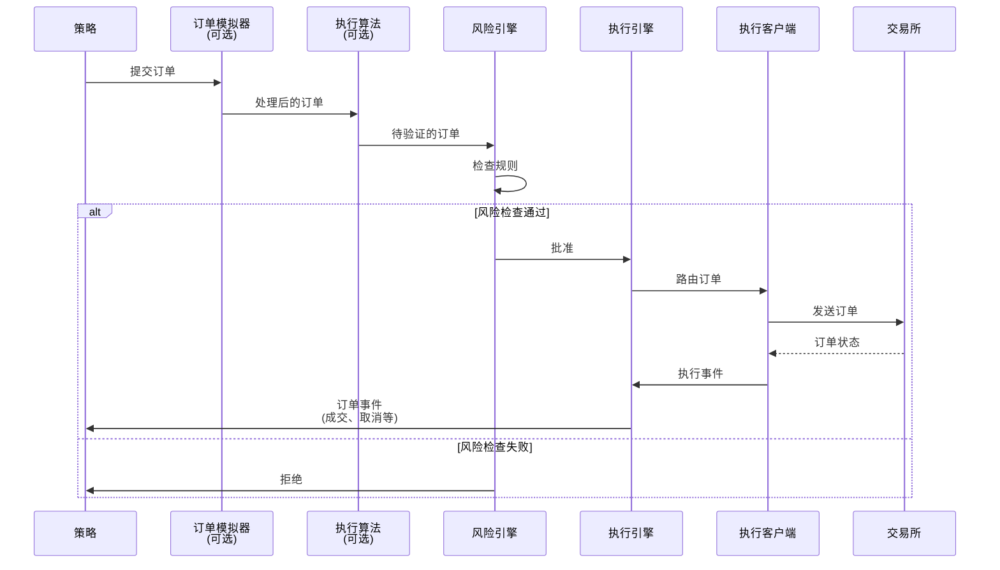
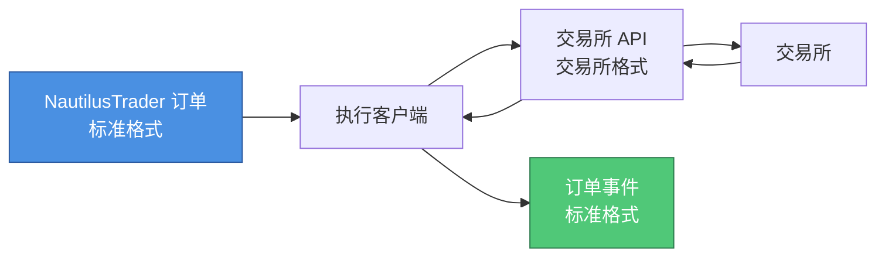
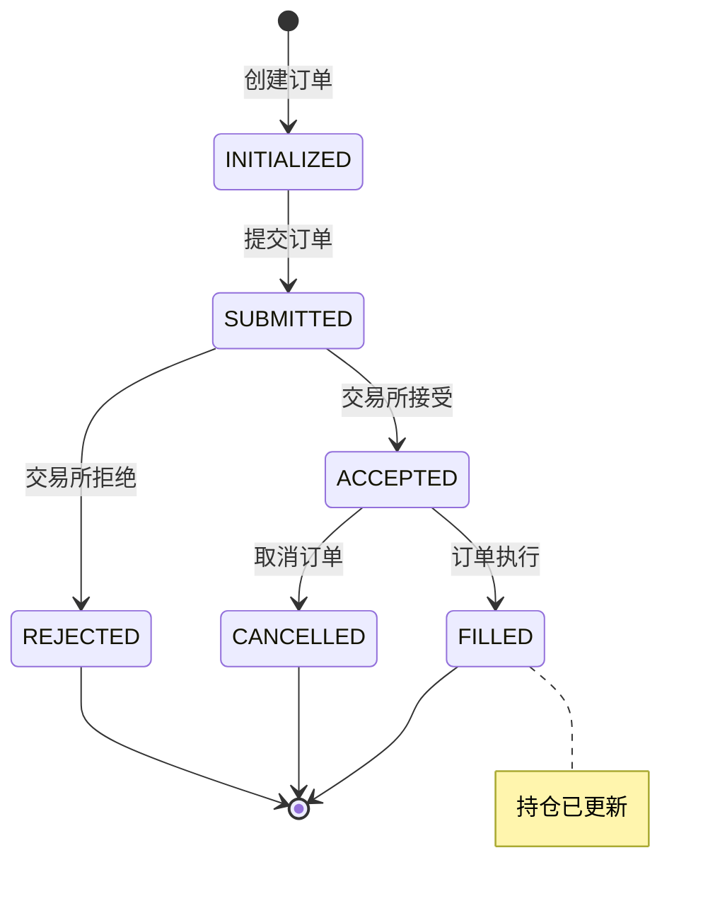

# 第 5 课：理解执行流

**⏱ 课时**：2 小时  
**🎯 学习目标**：理解订单执行流程，掌握订单生命周期和事件处理  
**📚 难度**：⭐⭐ 中级

---

## 📖 课程概览

本课将深入讲解 NautilusTrader 中的执行流机制。我们将追踪订单从策略创建到交易所确认的完整路径，学习风险引擎的作用、执行引擎的处理流程，以及如何正确处理订单事件。理解执行流是编写安全可靠交易策略的关键。

## 学习目标

在本课结束时，您将了解：

-   订单如何从策略流向交易所
-   什么是风险检查以及为什么它们很重要
-   订单事件如何处理
-   如何跟踪订单生命周期
-   订单成交或被拒绝时会发生什么

## 执行之旅

让我们追踪订单如何从您的策略流向交易所：



## 第 1 步：创建订单

### 在您的策略中

当您想交易时，您创建一个订单：

```python
def on_bar(self, bar: Bar):
    # 创建市价单
    order = self.order_factory.market(
        instrument_id=self.instrument_id,
        order_side=OrderSide.BUY,           # 买入
        quantity=Quantity.from_int(10),     # 10 单位
        time_in_force=TimeInForce.GTC,     # 直到取消
    )

    # 提交订单
    self.submit_order(order)
```

### 接下来会发生什么？

订单不会直接发送到交易所！它首先经过几次检查。

## 第 2 步：可选处理

### 订单模拟器

**它做什么**：在本地模拟订单执行（用于测试）

**何时使用**：当您想在不实际执行的情况下测试订单逻辑时

```python
# 订单模拟器可以模拟滑点、延迟等
```

### 执行算法

**它做什么**：修改订单（例如，将大订单拆分为小订单）

**何时使用**：用于高级订单管理（冰山订单、TWAP 等）

## 第 3 步：风险检查

### 为什么需要风险检查？

风险检查就像**安全卫士**，防止危险的交易：

-   防止您损失太多钱
-   阻止您下过大的订单
-   确保您有足够的资金

### 现实世界的类比

将风险检查想象成**信用卡限额**：

-   您不能花费超过您的限额
-   银行在批准每笔交易之前进行检查
-   如果您超过限额，交易将被拒绝

### 常见的风险规则

```python
# 简化的风险规则

# 1. 持仓限制
if current_position + order_quantity > max_position:
    REJECT("Position limit exceeded")

# 2. 订单大小限制
if order_quantity > max_order_size:
    REJECT("Order too large")

# 3. 资金限制
if required_capital > available_capital:
    REJECT("Insufficient capital")

# 4. 价格限制
if order_price > max_allowed_price:
    REJECT("Price too high")
```

### 如果风险检查失败会发生什么？

```python
def on_order_rejected(self, event: OrderRejected):
    self.log.warning(f"Order rejected: {event.reason}")
    # 您的策略可以对拒绝做出反应
```

## 第 4 步：执行引擎

### 它做什么

执行引擎就像**交通控制器**：

-   接收已批准的订单
-   将它们路由到正确的交易所客户端
-   跟踪订单状态
-   管理订单生命周期

### 订单路由

引擎决定使用哪个客户端：

```python
# 引擎逻辑（简化）
if order.client_id:
    # 使用特定客户端
    client = clients[order.client_id]
else:
    # 使用此交易场所的默认客户端
    client = default_clients[order.instrument_id.venue]
```

## 第 5 步：执行客户端

### 它做什么

执行客户端就像**翻译器**：

-   将 NautilusTrader 订单转换为交易所特定格式
-   通过 API 将订单发送到交易所
-   接收响应并转换回来

### 交易所通信



## 第 6 步：订单事件

### 什么是订单事件？

订单事件告诉您订单发生了什么：

-   **OrderInitialized** - 订单已创建

-   **OrderSubmitted** - 订单已发送到交易所

-   **OrderAccepted** - 交易所接受了订单

-   **OrderFilled** - 订单已执行（部分或全部）

-   **OrderCancelled** - 订单已取消

-   **OrderRejected** - 交易所拒绝了订单

### 订单生命周期



### 在策略中处理事件

您的策略通过处理方法接收事件：

```python
def on_order_event(self, event: OrderEvent):
    """
    任何订单事件时调用。
    """
    if isinstance(event, OrderFilled):
        self.log.info(f"Order filled: {event.fill_qty} at {event.fill_px}")
    elif isinstance(event, OrderRejected):
        self.log.warning(f"Order rejected: {event.reason}")

def on_order_filled(self, event: OrderFilled):
    """
    订单成交时专门调用。
    """
    # 更新您的策略状态
    self.position_size += event.fill_qty
    self.log.info(f"New position size: {self.position_size}")
```

## 完整示例

让我们看一个处理完整执行流的策略：

```python
class ExecutionAwareStrategy(Strategy):
    def __init__(self):
        super().__init__()
        self.pending_orders = {}  # 跟踪订单
        self.position_size = 0

    def on_bar(self, bar: Bar):
        # 创建订单
        if self.should_trade():
            order = self.order_factory.market(
                instrument_id=self.instrument_id,
                order_side=OrderSide.BUY,
                quantity=Quantity.from_int(10),
            )

            # 存储订单 ID 以跟踪它
            self.pending_orders[order.client_order_id] = order

            # 提交订单
            self.submit_order(order)
            self.log.info(f"Order submitted: {order.client_order_id}")

    def on_order_accepted(self, event: OrderAccepted):
        """订单被交易所接受"""
        self.log.info(f"✅ Order accepted: {event.client_order_id}")

    def on_order_filled(self, event: OrderFilled):
        """订单已成交"""
        self.log.info(
            f"💰 Order filled: {event.fill_qty} @ {event.fill_px}",
            color=LogColor.GREEN,
        )

        # 更新持仓
        if event.order_side == OrderSide.BUY:
            self.position_size += event.fill_qty
        else:
            self.position_size -= event.fill_qty

        # 从待处理中移除
        self.pending_orders.pop(event.client_order_id, None)

    def on_order_rejected(self, event: OrderRejected):
        """订单被拒绝"""
        self.log.warning(
            f"❌ Order rejected: {event.reason}",
            color=LogColor.RED,
        )

        # 从待处理中移除
        self.pending_orders.pop(event.client_order_id, None)

    def on_order_cancelled(self, event: OrderCancelled):
        """订单已取消"""
        self.log.info(f"🚫 Order cancelled: {event.client_order_id}")

        # 从待处理中移除
        self.pending_orders.pop(event.client_order_id, None)
```

## 理解订单状态

### 检查订单状态

您可以从缓存检查订单状态：

```python
def on_bar(self, bar: Bar):
    # 从缓存获取订单
    order = self.cache.order(self.order_id)

    if order:
        if order.is_pending_cancel():
            self.log.info("Order is being cancelled")
        elif order.is_filled():
            self.log.info("Order is completely filled")
        elif order.is_rejected():
            self.log.warning("Order was rejected")
```

## 常见模式

### 模式 1：等待订单成交

```python
def on_bar(self, bar: Bar):
    if not self.has_pending_order:
        order = self.order_factory.market(...)
        self.submit_order(order)
        self.has_pending_order = True
        self.pending_order_id = order.client_order_id

def on_order_filled(self, event: OrderFilled):
    if event.client_order_id == self.pending_order_id:
        self.has_pending_order = False
        # 现在可以安全地下一个订单
```

### 模式 2：优雅地处理拒绝

```python
def on_order_rejected(self, event: OrderRejected):
    self.log.warning(f"Order rejected: {event.reason}")

    # 用更小的数量重试
    if "insufficient" in event.reason.lower():
        smaller_order = self.order_factory.market(
            quantity=Quantity.from_int(5),  # 一半大小
            ...
        )
        self.submit_order(smaller_order)
```

### 模式 3：跟踪所有订单

```python
def __init__(self):
    super().__init__()
    self.order_history = []  # 跟踪所有订单

def on_order_event(self, event: OrderEvent):
    # 记录所有订单事件
    self.order_history.append({
        'time': event.ts_event,
        'order_id': event.client_order_id,
        'event_type': type(event).__name__,
    })
```

## 💡 实践任务

### 任务 1：理解执行流程

-   [ ] 画出订单从策略到交易所的完整流程图
-   [ ] 解释风险引擎、执行引擎的作用
-   [ ] 理解为什么需要风险检查

### 任务 2：处理订单事件

创建一个策略，正确处理所有订单事件：

-   [ ] `on_order_accepted()` - 订单被接受
-   [ ] `on_order_filled()` - 订单成交
-   [ ] `on_order_rejected()` - 订单被拒绝
-   [ ] `on_order_cancelled()` - 订单被取消

### 任务 3：跟踪订单状态

-   [ ] 维护一个订单字典，跟踪所有待处理订单
-   [ ] 在订单成交后更新持仓
-   [ ] 在订单被拒绝时记录原因

### 任务 4：错误处理

-   [ ] 处理订单被拒绝的情况
-   [ ] 实现订单重试逻辑（如果需要）
-   [ ] 添加日志记录所有订单事件

## 📚 知识检查

### 基础问题

1. 订单从策略到交易所要经过哪些步骤？
2. 风险引擎检查什么？
3. 订单可能处于哪些状态？
4. 如何知道订单是否成交？

### 进阶问题

1. 为什么需要风险引擎？可以绕过它吗？
2. 订单事件和订单状态的区别是什么？
3. 如何处理订单被拒绝的情况？
4. 执行引擎如何知道将订单发送到哪个交易所？

### 思考题

1. 如果风险引擎拒绝了订单，策略应该做什么？
2. 如何确保订单状态和持仓状态保持一致？
3. 在高频交易中，订单处理速度有多重要？

## 🔗 参考资料

### NautilusTrader 文档

-   [Execution Guide](../../concepts/execution.md) - 完整执行文档
-   [Orders Guide](../../concepts/orders.md) - 所有订单类型和选项
-   [Risk Guide](../../concepts/risk.md) - 风险管理功能
-   [Order Events](../../concepts/orders.md#order-events) - 订单事件详解

### 相关概念

-   [Strategies Guide](../../concepts/strategies.md) - 策略如何创建订单
-   [Architecture Guide](../../concepts/architecture.md) - 系统架构

## 📌 核心要点总结

1. **执行流 = 策略 → 可选处理 → 风险检查 → 执行引擎 → 交易所**
2. **风险引擎防止危险的交易，保护您的资金**
3. **订单有完整的生命周期，从创建到成交或取消**
4. **订单事件通知策略订单状态变化**
5. **正确处理订单事件是策略可靠性的关键**
6. **理解执行流有助于调试订单问题**

## ➡️ 下一课预告

**第 6 课：回测实践**

在下一课中，我们将学习：

-   如何准备历史数据
-   如何配置回测引擎
-   如何运行回测并分析结果
-   常见的回测陷阱和最佳实践

**准备工作**：

-   确保理解数据流和执行流
-   准备好学习回测方法
-   准备一些历史数据（或使用测试数据）

---

**🎯 学习检验标准**：

-   ✅ 能画出完整的执行流程图
-   ✅ 能正确处理所有订单事件
-   ✅ 能跟踪订单状态和持仓
-   ✅ 理解风险引擎的作用
-   ✅ 能调试订单执行问题

完成这些内容后，你已经掌握了执行流的核心知识！

## 总结

在本课中，我们学习了：

-   **订单流动**从策略 → 可选处理 → 风险检查 → 执行 → 交易所

-   **风险引擎**验证订单以防止危险的交易

-   **执行引擎**将订单路由到正确的交易所客户端

-   **订单事件**告诉您订单发生了什么

-   **您的策略**可以对订单事件做出反应以管理状态

## 下一步

既然您了解了数据流和执行流，让我们用真实数据练习回测！

👉 **下一课**：[第 6 课：回测实践](第06课_回测实践.md)
