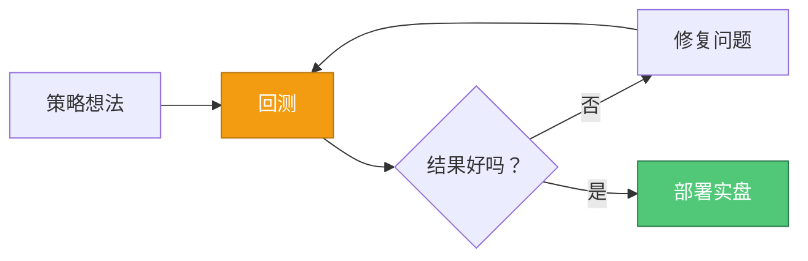

# 第 6 课：回测实践

**⏱ 课时**：2.5 小时  
**🎯 学习目标**：掌握回测方法，学会分析回测结果，避免常见陷阱  
**📚 难度**：⭐⭐ 中级

---

## 📖 课程概览

本课将深入讲解如何使用 NautilusTrader 进行回测。我们将学习如何准备历史数据、配置回测引擎、运行回测并分析结果。同时，我们也会探讨常见的回测陷阱，如前瞻偏差、过度拟合等，帮助您获得更可靠的回测结果。

## 学习目标

在本课结束时，您将能够：

-   从文件加载历史数据
-   配置回测参数
-   运行回测并分析结果
-   理解常见的回测陷阱
-   解释回测报告

## 什么是回测？

### 简单解释

**回测**就像**重放视频游戏**——您在历史市场数据上测试您的策略，看看它的表现如何。

### 为什么回测？



回测帮助您：

1.  **无风险测试** - 没有真金白银的风险

2.  **发现错误** - 在实盘之前发现问题

3.  **优化参数** - 测试不同的设置

4.  **建立信心** - 知道您的策略有效

## 第 1 步：准备数据

### 数据格式

NautilusTrader 支持各种数据格式：

-   **CSV 文件** - 简单的文本格式

-   **Parquet 文件** - 高效的二进制格式（推荐）

-   **数据库** - SQL 数据库

### 示例：加载 CSV 数据

```python
import pandas as pd
from nautilus_trader.model import Bar, BarType
from nautilus_trader.core.datetime import dt_to_unix_nanos

def load_bars_from_csv(file_path: str, instrument_id, bar_type: BarType) -> list[Bar]:
    """
    从 CSV 文件加载 K 线。

    CSV 格式：
    timestamp,open,high,low,close,volume
    2024-01-01 00:00:00,50000,50100,49900,50050,1000
    """
    df = pd.read_csv(file_path)
    bars = []

    for _, row in df.iterrows():
        # 将时间戳转换为纳秒
        timestamp = pd.to_datetime(row['timestamp'])
        ts_event = dt_to_unix_nanos(timestamp)

        # 创建 K 线
        bar = Bar(
            bar_type=bar_type,
            open=Price.from_str(str(row['open'])),
            high=Price.from_str(str(row['high'])),
            low=Price.from_str(str(row['low'])),
            close=Price.from_str(str(row['close'])),
            volume=Quantity.from_str(str(row['volume'])),
            ts_event=ts_event,
            ts_init=ts_event,
        )
        bars.append(bar)

    return bars
```

### 使用测试数据提供商

对于学习，您可以使用内置的测试数据：

```python
from nautilus_trader.test_kit.providers import TestDataProvider

# 生成示例 K 线
bars = TestDataProvider.bars(
    instrument_id=instrument_id,
    bar_type=bar_type,
    start=datetime(2024, 1, 1),
    end=datetime(2024, 1, 31),
    interval=timedelta(minutes=1),
)
```

## 第 2 步：配置回测

### 基本配置

```python
from nautilus_trader.backtest.config import BacktestEngineConfig
from nautilus_trader.config import LoggingConfig
from nautilus_trader.data.config import DataEngineConfig

engine_config = BacktestEngineConfig(
    trader_id=TraderId("MY_TRADER-001"),

    # 数据引擎设置
    data_engine=DataEngineConfig(
        time_bars_interval_type="left-open",
        time_bars_timestamp_on_close=True,
        validate_data_sequence=True,  # 检查数据是否有序
    ),

    # 日志设置
    logging=LoggingConfig(
        log_level="INFO",  # DEBUG, INFO, WARNING, ERROR
    ),
)
```

### 重要设置

#### 验证数据序列

```python
validate_data_sequence=True  # 推荐
```

-   检查数据是否按时间顺序排列
-   防止乱序数据导致的错误
-   稍慢，但更安全

#### K 线时间戳在收盘时

```python
time_bars_timestamp_on_close=True  # 推荐
```

-   时间戳标记 K 线收盘时
-   对回测更真实

## 第 3 步：运行回测

### 完整示例

```python
from datetime import UTC, datetime
from decimal import Decimal

from nautilus_trader.backtest.engine import BacktestEngine
from nautilus_trader.model import BarType, TraderId
from nautilus_trader.model.currencies import USD
from nautilus_trader.model.enums import AccountType, OmsType
from nautilus_trader.model.identifiers import Venue
from nautilus_trader.model.objects import Money
from nautilus_trader.test_kit.providers import TestInstrumentProvider

# 您的策略
from my_strategy import MyStrategy

def run_backtest():
    # 1. 创建引擎
    engine = BacktestEngine(config=engine_config)

    # 2. 添加交易场所
    engine.add_venue(
        venue=Venue("XCME"),
        oms_type=OmsType.NETTING,
        account_type=AccountType.MARGIN,
        starting_balances=[Money(1_000_000, USD)],
        base_currency=USD,
        default_leverage=Decimal(1),
    )

    # 3. 添加工具
    instrument = TestInstrumentProvider.eurusd_future(
        expiry_year=2024,
        expiry_month=3,
        venue_name="XCME",
    )
    engine.add_instrument(instrument)

    # 4. 加载并添加数据
    bar_type = BarType.from_str(f"{instrument.id}-1-MINUTE-LAST-EXTERNAL")
    bars = load_bars_from_csv("data.csv", instrument.id, bar_type)
    engine.add_data(bars)

    # 5. 添加策略
    strategy = MyStrategy(input_bartype=bar_type)
    engine.add_strategy(strategy)

    # 6. 运行
    engine.run()

    # 7. 清理
    engine.dispose()
```

## 第 4 步：分析结果

### 访问结果

回测后，您可以访问结果：

```python
# 获取投资组合
portfolio = engine.portfolio

# 获取账户
account = portfolio.account(account_id)

# 获取最终余额
final_balance = account.balance_total(USD)
print(f"Final balance: {final_balance}")

# 获取持仓
for position in portfolio.positions():
    print(f"Position: {position}")
    print(f"Unrealized PnL: {position.unrealized_pnl(USD)}")

# 获取订单
for order in engine.cache.orders():
    print(f"Order: {order}")
```

### 理解输出

#### 账户余额

```python
starting_balance = Money(1_000_000, USD)
final_balance = account.balance_total(USD)
profit_loss = final_balance - starting_balance

print(f"Starting: {starting_balance}")
print(f"Final: {final_balance}")
print(f"Profit/Loss: {profit_loss}")
```

#### 持仓摘要

```python
for position in portfolio.positions():
    if not position.is_closed():
        print(f"Open position: {position.quantity} {position.instrument_id}")
        print(f"Entry price: {position.avg_px_open}")
        print(f"Current price: {position.last_px}")
        print(f"Unrealized PnL: {position.unrealized_pnl(USD)}")
```

#### 订单历史

```python
for order in engine.cache.orders():
    print(f"Order {order.client_order_id}:")
    print(f"  Side: {order.side}")
    print(f"  Quantity: {order.quantity}")
    print(f"  Status: {order.status}")
    if order.is_filled():
        print(f"  Fill price: {order.avg_px}")
```

## 常见的回测陷阱

### 1. 前瞻偏差

**问题**：在策略中使用未来数据

**示例**:

```python
# ❌ 错误
def on_bar(self, bar: Bar):
    # 使用下一根 K 线的价格！
    next_bar = self.get_next_bar()  # 这还不存在！
    if next_bar.close > bar.close:
        self.buy()

# ✅ 正确
def on_bar(self, bar: Bar):
    # 只使用当前和过去的数据
    if bar.close > self.previous_close:
        self.buy()
    self.previous_close = bar.close
```

### 2. 生存偏差

**问题**：只测试仍然存在的工具

**解决方案**：在测试数据中包含已退市的工具

### 3. 过度拟合

**问题**：策略在测试数据上表现很好，但在真实交易中失败

**迹象**:

-   策略有太多参数
-   结果"好得不真实"
-   小的更改会破坏策略

**解决方案**:

-   使用样本外测试
-   保持策略简单
-   在多个时间段测试

### 4. 忽略交易成本

**问题**：不考虑费用和滑点

**解决方案**：在回测中配置真实的费用

```python
engine.add_venue(
    venue=Venue("BINANCE"),
    # ... 其他设置 ...
    # 费用通常按交易场所配置
)
```

### 5. 数据质量问题

**问题**：缺失数据、错误的时间戳、错误的价格

**解决方案**:

-   在回测之前验证数据
-   检查缺口和异常值
-   使用 `validate_data_sequence=True`

## 最佳实践

### 1. 从简单开始

```python
# 从简单策略开始
class SimpleStrategy(Strategy):
    def on_bar(self, bar: Bar):
        # 先使用简单逻辑
        if bar.close > bar.open:
            self.buy()
```

### 2. 验证数据

```python
# 检查数据质量
print(f"Total bars: {len(bars)}")
print(f"Date range: {bars[0].ts_event} to {bars[-1].ts_event}")
print(f"Any gaps? Check timestamps are sequential")
```

### 3. 使用真实设置

```python
# 使用真实的起始资金
starting_balances=[Money(10_000, USD)]  # 不是 100 万美元！

# 考虑费用
# 使用真实的杠杆
default_leverage=Decimal(1)  # 初学者不使用杠杆
```

### 4. 测试多个场景

```python
# 在不同时间段测试
periods = [
    (datetime(2023, 1, 1), datetime(2023, 3, 31)),  # Q1
    (datetime(2023, 4, 1), datetime(2023, 6, 30)),  # Q2
    (datetime(2023, 7, 1), datetime(2023, 9, 30)),  # Q3
]

for start, end in periods:
    bars = filter_bars_by_date(bars, start, end)
    # 运行回测
```

## 解释结果

### 好结果

✅ **在不同时间段一致的利润**

✅ **合理的回撤**（临时损失）

✅ **稳定的表现**（不仅仅是幸运的交易）

### 警告信号

⚠️ **极高的回报** - 可能是过度拟合

⚠️ **只在一个时间段有效** - 不稳健

⚠️ **许多被拒绝的订单** - 风险检查过于严格或策略问题

## 💡 实践任务

### 任务 1：准备回测数据

-   [ ] 下载或准备历史数据（CSV 或 Parquet 格式）
-   [ ] 验证数据质量（检查缺失值、时间戳顺序）
-   [ ] 将数据转换为 NautilusTrader 格式

### 任务 2：运行回测

-   [ ] 配置回测引擎
-   [ ] 加载数据到引擎
-   [ ] 运行回测并观察输出
-   [ ] 分析回测结果

### 任务 3：分析结果

-   [ ] 计算总盈亏
-   [ ] 分析最大回撤
-   [ ] 检查订单执行情况
-   [ ] 识别潜在问题

### 任务 4：避免常见陷阱

-   [ ] 检查是否存在前瞻偏差
-   [ ] 验证是否考虑了交易成本
-   [ ] 在不同时间段测试策略
-   [ ] 评估是否存在过度拟合

## 📚 知识检查

### 基础问题

1. 回测的目的是什么？
2. 如何加载 CSV 格式的历史数据？
3. 回测配置中的 `validate_data_sequence` 是什么？
4. 什么是前瞻偏差？

### 进阶问题

1. 如何判断回测结果是否可靠？
2. 过度拟合的迹象有哪些？
3. 为什么需要在多个时间段测试策略？
4. 如何配置真实的交易成本？

### 思考题

1. 回测结果好是否意味着实盘也会好？
2. 如何平衡回测的准确性和速度？
3. 如何处理数据质量问题？

## 🔗 参考资料

### NautilusTrader 文档

-   [Backtesting Guide](../../concepts/backtesting.md) - 完整回测文档
-   [Data Guide](../../concepts/data.md) - 数据加载和管理
-   [Reports Guide](../../concepts/reports.md) - 分析回测结果
-   [Backtest Engine API](../../api_reference/backtesting.md) - API 参考

### 回测最佳实践

-   [Backtesting Best Practices](https://www.investopedia.com/articles/trading/11/backtesting-basics.asp)
-   [Common Backtesting Mistakes](https://www.quantstart.com/articles/Common-Backtesting-Mistakes/)

## 📌 核心要点总结

1. **回测 = 在历史数据上测试策略**
2. **数据质量决定回测准确性**
3. **配置影响回测行为，需要仔细设置**
4. **避免前瞻偏差、过度拟合等常见陷阱**
5. **在多个时间段测试，验证策略稳健性**
6. **回测是实盘前的必要步骤，但不是保证**

## ➡️ 下一课预告

**第 7 课：实盘部署**

在下一课中，我们将学习：

-   如何准备策略进行实盘交易
-   如何连接到真实交易所
-   如何配置实盘交易节点
-   如何监控和管理实盘交易

**准备工作**：

-   确保策略已经过充分回测
-   准备好交易所 API 密钥（测试网）
-   理解实盘交易的风险

---

**🎯 学习检验标准**：

-   ✅ 能准备和加载历史数据
-   ✅ 能配置和运行回测
-   ✅ 能分析回测结果
-   ✅ 能识别和避免常见陷阱
-   ✅ 理解回测的局限性

完成这些内容后，你已经掌握了回测的核心技能！

## 总结

在本课中，我们学习了：

-   **回测**在历史数据上测试策略

-   **数据准备**对准确结果至关重要

-   **配置**影响回测行为

-   **常见陷阱**可能导致误导性结果

-   **最佳实践**有助于确保可靠的回测

## 下一步

既然您可以回测策略，您就可以实盘部署它们了！

👉 **下一课**：[第 7 课：实盘部署](第07课_实盘部署.md)
